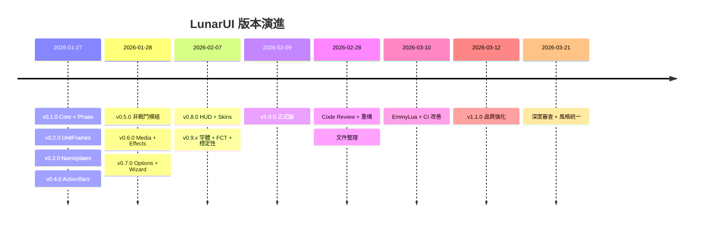

# Changelog

All notable changes to LunarUI will be documented in this file.

Format: [Keep a Changelog](https://keepachangelog.com/en/1.1.0/) &middot; Versioning: [SemVer](https://semver.org/spec/v2.0.0.html)

---

## [Unreleased]

### Planned

- 自訂月相材質（手繪）

### Fixed

- **WoW 12.0 Secret Value Taint** — AuraFrames/AuraSystem/Nameplates/CastBar 的 spellId、isStealable、isPlayerAura、isHarmfulAura 在戰鬥中為 secret value，加入 pcall 保護
- **DEBUFF_TYPE_COLORS 載入時機** — 全域變數可能尚未初始化，加入 fallback chain + nil guard
- **InstallWizard uiScale** — ShowInstallWizard 改為讀取 UIParent:GetEffectiveScale()（原硬編碼 0.75），重開時同步 slider widget
- **SafeCall fallback** — 改用 IsDebugMode() 檢查 debug 模式（原 LunarUI.Debug method 永遠 truthy）
- **Tags 取整不一致** — lunar:power:percent 改用 math.floor(x+0.5) 四捨五入，與 lunar:health:percent 一致
- **深度代碼審查（8 輪 / 35 個 bug 修復）**
  - pairs() 迴圈中刪除元素 — Lua 5.1 UB（5 處，改用 snapshot/wipe）
  - C_Timer.After 無法取消的回呼加入 generation counter（Init、CooldownTracker、AuraFrames、SellJunk、bank batch）
  - 框架生命週期：re-enable 時框架洩漏（AuraFrames icon、ActionBars combat retry、InstallWizard、PerformanceMonitor）
  - Taint 修復：Loot Hide() in Show() hook、Tooltip GameTooltip guard
  - Re-enable 修復：FCT queueFrame OnUpdate、Chat eventFrame、Minimap frame refs
  - Config.lua pcall 漏傳 self、FrameMover wipe→hide+script、Skins retry/mark
  - Bags SecureActionButtonTemplate + item2 屬性修復右鍵使用物品
  - Minimap 按鈕佈局用可見計數取代原始索引
  - Skins LoadAllSkins 檢查已載入 addon（/reload 後 ADDON_LOADED 不再觸發）

### Changed

- **代碼風格全面統一（6 輪審查）**
  - 所有 69 個 Lua 檔案統一 `local format = string.format` upvalue
  - stdlib upvalue 統一 camelCase（mathFloor、tableInsert、stringUtf8sub 等）
  - 所有 bare print() 改為 LunarUI:Print()（SafeCall 三層 fallback）
  - 所有英文註解翻譯為繁體中文（包含 Skins、Bags、HUD 子模組）
  - DB 存取統一使用 GetModuleDB()（含 AuraFilter hot path）
  - DEBUFF_TYPE_COLORS mock 修正為 {r=,g=,b=} 命名鍵格式
- **測試品質改善（4 輪審查）**
  - 移除 70+ 低價值測試（exports exist、重複、tautological）
  - 新增 DB toggle 測試（chat emoji/spam、automation repair/release）
  - 新增 AuraFilter onlyPlayerDebuffs 邏輯測試
  - 修復測試狀態洩漏（serialization_spec、utils_spec、chat_spec、hideblizzbars_spec、automation_spec）
  - Chat filter 測試改為直接匯出存取（消除脆弱探索機制）
  - ClassResources 測試加入 RegisterMovableFrame 追蹤驗證
  - mock_frame GetChildren/GetRegions 修正為空 varargs
- 測試數量 994 → 909（移除低價值 -85，新增高價值 +12 = 淨 -85）
- **代碼風格統一（4 輪）**
  - 所有 22 個主要 Lua 檔案的註解統一為繁體中文
  - Nameplates Fix #N 歷史標記清理（10 處）
  - print() → LunarUI:Print() 日誌統一
  - colon→dot 語法統一（Automation、Config、Minimap）
  - 共用常數 CASTBAR_COLOR / BG_DARKEN 集中到 Core/Media.lua
  - 本地化補齊（Minimap mail text、FCT label、DataTexts latency）
  - FCT 熱路徑全域快取（mathFloor、mathRandom、tableInsert、tableRemove）
  - ClassResources / CooldownTracker 移除冗餘 inline 拖曳系統
  - Dead code 清除（Bags 月相感知 section、ActionBars tombstone section、ClassResources _playerClass）
  - AuraFrames CreateAuraIcon 死參數移除
- 測試數量 920 → 994（+74 tests）

---

## [1.1.0] &mdash; 2026-03-12

### Added

- **Makefile** &mdash; 標準化開發指令（`make test` / `lint` / `format` / `coverage` / `check`）
- **LunarUI_Debug** &mdash; VigorDebug 診斷工具抽取為 LoadOnDemand 獨立插件，`/lunar debugvigor` 時自動載入
- **EmmyLua 型別定義** &mdash; `wow_api.def.lua`（WoW API 完整 stub）、`spec/busted.def.lua`（busted/luassert stub），以 `---@meta` 標記
- **EmmyLua 診斷抑制** &mdash; 全部 69 個 `.lua` 檔案第一行統一加入 `---@diagnostic disable:` header，消除 IDE 已知誤報
- **`.emmyrc.json`** &mdash; EmmyLua Analyzer 專案設定（`wow_api.def.lua` 納入 workspace library）

### Fixed

- **UnitFrames Taint Error** &mdash; 更新 oUF 到最新版本修復 WoW 12.0 forbidden table 錯誤
  - 問題：每次登入時出現 "attempted to iterate a forbidden table" 錯誤
  - 根因：舊版 oUF 庫在 WoW 12.0 中存在兼容性 bug
  - 解決：從 GitHub 官方倉庫更新 oUF 到最新版本
  - 驗證：登入、重載、框架顯示均正常，無錯誤訊息

- **代碼審查第二輪** &mdash; 修復 24 個效能與記憶體洩漏問題
  - **UnitFrames/Layout.lua** (8 個修復)
    - HealthPrediction 治療預測條錨點修正至 StatusBarTexture
    - playerEnterWorldFrame 事件清理防止記憶體洩漏
    - StatusBar 材質快取添加失效機制
    - 戰鬥等待框架重用避免累積洩漏
    - AuraFilter DB 設定快取避免高頻查詢
    - deathUnitMap 支援同一 unit 多個框架（party+raid）
    - 提取 CreateRaidDebuffs helper 避免代碼重複
    - 過濾 duration==0 的永久 buff
  - **HUD/CooldownTracker.lua** (4 個修復)
    - SPELLS_CHANGED 事件添加 isInitialized 檢查
    - SetupTrackedSpells 預過濾法術，移除高頻 IsSpellKnownByPlayer 檢查
    - Cleanup 函數添加 trackedSpells wipe
    - 修復 cacheSize 計數錯誤，確保快取失效機制正確運作
  - **ActionBars/ActionBars.lua** (2 個修復)
    - StanceBar 事件洩漏 - 5 個事件未在 cleanup 中取消註冊
    - PetBar 事件洩漏 - 2 個事件未在 cleanup 中取消註冊
  - **Modules/Minimap.lua** (3 個修復)
    - minimapFrame 事件洩漏 - 缺少 UnregisterAllEvents
    - mail 框架事件洩漏 - UPDATE_PENDING_MAIL 未取消註冊
    - diff 框架事件洩漏 - 3 個難度相關事件未取消註冊
  - **HUD/ClassResources.lua** (1 個修復)
    - PLAYER_SPECIALIZATION_CHANGED 事件缺少 isInitialized guard

- **Bags/Chat Cleanup** &mdash; 補齊 `CleanupBags()` 和 `CleanupChat()` 缺漏的框架引用清理（事件框架、計時器 nil 化）
- **Debug Overlay Tests** &mdash; 修正 module-local upvalue 快取導致的測試失敗，改為循序測試策略
- **Serialization.lua** &mdash; `MergeTable` 非 table source 輸入會 crash（新增 type guard）
- **本地化** &mdash; 修復 FrameMover 選項缺少的語系字串、Options locale 繼承問題
- **C_AddOns** &mdash; 全面更新為 `C_AddOns` 命名空間 API（WoW 12.0 相容性）
- **Init.lua** &mdash; 啟動時預載 LunarUI_Options 以註冊暴雪 ESC 設定面板入口
- **Tags.lua** &mdash; 所有 tag 方法加入 SafeTag pcall 安全包裝，防止 oUF 崩潰
- **Config.lua** &mdash; OnDisable 加入 UnregisterEvent 事件清理，防止記憶體洩漏
- **Bags.lua** &mdash; 物品格子加入 `RegisterForClicks("LeftButtonUp", "RightButtonUp")`，修復右鍵無法使用物品
- **CI** &mdash; `.luacheckrc` 新增 `busted.def.lua` 排除規則，修復 luacheck 13 個 stub 檔案誤報

### Changed

- 更新介面版本至 120001（支援 WoW Patch 12.0.1）
- **Utils.lua** &mdash; 從 Minimap/Chat 提取 `FormatGameTime`、`FormatCoordinates`、`EscapePattern` 至 Utils.lua 共用
- **Minimap.lua** &mdash; `UpdateCoordinates` / `UpdateClock` 改用 `LunarUI.FormatCoordinates()` / `LunarUI.FormatGameTime()`
- **Chat.lua** &mdash; `CheckKeywordAlert` 改用 `LunarUI.EscapePattern()`
- **Core** &mdash; 移除 `Core/Options.lua`（1,587 行），HUD 方法遷移至 Config.lua；LunarUI_Options 為唯一 Options provider
- **Core** &mdash; 提取 `GetModuleDB()` / `CreateIconBorder()` 共用工具函數至 Utils.lua / Skins.lua
- **ActionBars** &mdash; 合併 N 個獨立 hoverFrame OnUpdate 為單一 handler，減少 87.5% 無謂輪詢
- **ActionBars** &mdash; 拆分 `UpdateFadeAndHover`（101 行）為 `UpdateFadeAnimation` + `UpdateHoverDetection` + 協調器
- **Nameplates** &mdash; 拆分 `UpdateNameplateStacking`（106 行）為 `CollectVisibleNameplates` + `SortNameplatesByY` + `DetectOverlaps` + `ApplyStackOffsets` + 協調器
- **UnitFrames / Commands** &mdash; 減少重複代碼，提取共用模式
- **測試基礎設施** &mdash; 提取共用 `spec/mock_frame.lua` MockFrame 模組，消除 7 個 spec 檔案的重複 mock 定義
- **Nameplates** &mdash; 匯出 `CLASSIFICATION_COLORS`、`NPC_ROLE_COLORS`、`GetNPCRoleColor` 供測試存取
- 測試數量 354 → 920（+566 tests）
  - `spec/defaults_spec.lua` &mdash; 134 tests，驗證 Defaults.lua 全部 16 模組 key、11 unit type、enum 值、型別一致性
  - `spec/presets_spec.lua` &mdash; 18 tests，驗證 GetCurrentRole / ApplyRolePreset 角色預設系統
  - `spec/layout_spec.lua` &mdash; 35 tests，驗證 GetAuraSortFunction（4 sort methods × 正反向 + nil safety）、RebuildAuraFilterCache
  - `spec/actionbars_spec.lua` &mdash; 10 tests，ActionBars exports 與 lifecycle smoke test
  - `spec/nameplates_spec.lua` &mdash; 22 tests，CLASSIFICATION_COLORS / NPC_ROLE_COLORS 結構驗證 + GetNPCRoleColor 決策邏輯
- CI 覆蓋率門檻 33% → 43%
- **self→dot 重構** &mdash; 純函數由 `LunarUI:Fn()` 改為 `LunarUI.Fn()`（`RegisterMovableFrame`、`RegisterSkin`、`MarkSkinned`、`SetFont`、`GetModuleDB` 等）
- **nil-guard 清理** &mdash; 移除 `pairs()` 迴圈中冗餘的 nil 檢查（Lua 保證 key/value 皆非 nil）

---

## [1.0.0] &mdash; 2026-02-09

### 首個正式版

LunarUI v1.0.0 — 現代化 WoW UI 替換系統，涵蓋 Unit Frames、Nameplates、Action Bars、Bags、Chat、Minimap、Tooltip、HUD 等完整模組。

### Fixed

- **Taint 防護** &mdash; 移除 ActionBars secure frame SetParent，停用 FloatingCombatText（CombatLogGetCurrentEventInfo taint）
- **Init.lua** &mdash; ExecuteModuleCallback 加入 pcall 錯誤隔離 + IsEnabled() 延遲競態修復
- **Chat.lua** &mdash; 加入 chatFiltersRegistered 防止 filter 重複註冊；修復全域字串 double-save
- **Tooltip.lua** &mdash; 修復 re-enable 時 INSPECT_READY 事件不會重新註冊的 bug
- **Minimap.lua** &mdash; 加入 isInitialized guard 防止重複建立 timer
- **Bags.lua** &mdash; CloseBags() 補上 bankSearchTimer 取消
- **AuraFrames** &mdash; 修復 SetParent taint
- code review 修復 30+ 項問題（keybind、skin、dead code、銀行搜尋、錨點等）

### Performance

- Bags 搜尋邏輯提取為 named function 避免 closure GC
- Minimap ClearStaleButtonReferences 改為原地壓縮
- code smell 重構 &mdash; ApplyBackdrop 統一、DB 存取提取、快取上限

### Changed

- LLS linter 警告全面修復

---

## [0.9.2] &mdash; 2026-02-07

### Fixed

- **Cleanup 引用清理** &mdash; 8 處 cleanup 函數加入框架引用 nil 化
  - ClassResources / CooldownTracker / AuraFrames / DataTexts / ActionBars 的 `eventFrame`、`blizzHider`、`onUpdateFrame`、`combatFrame`
- **ActionBars** &mdash; `CleanupActionBars()` 加入 `wipe(pendingNormalClear)` / `wipe(pendingDesaturate)` 釋放按鈕引用
- **ActionBars** &mdash; `C_Timer.After` 回呼加入 `fadeInitialized` 守衛，防止模組 disable 後競態觸發淡出邏輯
- **PerformanceMonitor** &mdash; `StopUpdating()` 重置 `elapsed = 0`，避免重新啟用時立即觸發更新

---

## [0.9.1] &mdash; 2026-02-07

### Fixed

- **本地化** &mdash; 7 處硬編碼字串改為 `L[]` 引用（PerformanceMonitor 中文提示、Bags BoE/BoU）
- **記憶體清理** &mdash; 4 處 cleanup 缺陷修復
  - Nameplates：cleanup 後 nil 化 `nameplateTargetFrame` / `nameplateQuestFrame`
  - CooldownTracker：`spellTextureCache` 加入 2000 筆上限防止無限增長
  - FrameMover：`wipe(movers)` 釋放框架引用
  - ClassResources：專精切換時立即隱藏舊資源，避免 0.5s 延遲內顯示過期資訊
- **AuraFrames** &mdash; `C_UnitAuras` 迴圈加入 `pcall` 保護，防止 WoW 12.0 secret value 例外

### Changed

- **Design Tokens** &mdash; 12 處硬編碼色彩替換為 `LunarUI.Colors` token 引用
  - 新增 6 個 token：`bgOverlay`、`bgHUD`、`borderHUD`、`borderWarm`、`highlightBlue`、`stealableBorder`
  - 涵蓋 ActionBars、Nameplates、UnitFrames、AuraFrames、PerformanceMonitor、Loot、Bags
- TOC 版本號 `0.8.0` → `0.9.0`（對齊 CHANGELOG）

---

## [0.9.0] &mdash; 2026-02-07

### Added

- **自定義字體** &mdash; Options 新增 LSM 字體選擇器，即時切換所有 UI 文字字體
  - `LunarUI.SetFont(fs, size, flags)` &mdash; 統一字體設定 + 自動註冊
  - `LunarUI:ApplyFontSettings()` &mdash; 批次更新已註冊 FontString
  - Weak table `fontRegistry` 避免記憶體洩漏
- **FloatingCombatText** (`HUD/FloatingCombatText.lua`)
  - 輸出傷害 / 受到傷害 / 治療量浮動顯示
  - 暴擊放大 + 白色高亮
  - 向上飄動 + 淡出動畫（OutQuad / InQuad easing）
  - 框架池回收機制（20 個預建 FontString，避免 GC）
  - Options 完整設定（啟用、類別過濾、字體大小、暴擊倍數、動畫時長）

### Changed

- 18 個檔案（86 處）的 `STANDARD_TEXT_FONT` 硬編碼改為 `LunarUI.SetFont()` 動態字體

---

## [0.8.0] &mdash; 2026-02-07

### Added

- **HUD 戰鬥模組**
  - `HUD/PerformanceMonitor.lua` &mdash; FPS、延遲、記憶體即時顯示
  - `HUD/ClassResources.lua` &mdash; 職業資源條（連擊點、符文等）
  - `HUD/CooldownTracker.lua` &mdash; 技能冷卻追蹤
  - `HUD/AuraFrames.lua` &mdash; Buff / Debuff 顯示框架（含計時條）
- **Skins** &mdash; 14 個 Blizzard 介面皮膚（角色、法術書、天賦、任務、商人、社群等）
- **DataBars** &mdash; 經驗值、聲望、榮譽進度條
- **DataTexts** &mdash; 可自訂的文字資訊覆蓋層
- **Loot** &mdash; 拾取框架美化
- **Automation** &mdash; 自動修裝、戰場自動釋放、成就截圖、自動接受任務
- **Configuration Import / Export** (`Core/Serialization.lua`)
- **Layout Presets** (`Core/Presets.lua`) &mdash; DPS / Tank / Healer 佈局預設

### Changed

- Phase 系統簡化：移除月相循環機制，保留戰鬥狀態驅動
- 提取 `Core/Utils.lua` 共用工具函數（SafeCall、StripTextures、SkinStandardFrame）
- 提取 `ActionBars/HideBlizzardBars.lua` 為獨立模組
- Tooltip 掃描改用 `GetTooltipData()` 結構化 API（保留 `_G` fallback）
- Communities ScrollBar 皮膚新增 ScrollBox 分支（WoW 12.0）
- HUD 框架從硬編碼列表改為 `RegisterHUDFrame()` 自動註冊
- 所有模組新增 `onDisable` cleanup 函數
- Skin 系統重構：所有 skin 檔案新增 nil guard 防護

### Fixed

- **WoW 12.0 相容性**（10 項）
  - `HideBlizzardBars` &mdash; `bar.SetScale` 改用 `hooksecurefunc` 防止 taint
  - `Chat` &mdash; `ChatFrame_OnHyperlinkShow` 改用 per-frame `HookScript`
  - `ActionBars` &mdash; `EnterKeybindMode` / `StyleExtraActionButton` / `StyleZoneAbilityButton` 加入 `InCombatLockdown()` 防護
  - `Nameplates` &mdash; `UpdateNameplateStacking` 加入戰鬥鎖定檢查
  - `AuraFrames` &mdash; 移除已棄用的 `CancelUnitBuff` fallback
  - `Bags` &mdash; `SetHyperlink` 加入 pcall 保護
  - `Chat` &mdash; Tooltip 方法統一 pcall 包裹
- **Code Smell**（40 項）
  - 死代碼移除、重複函數合併、硬編碼顏色提取為常數
  - Temporal coupling 修復、magic number 命名
  - 36 個邏輯錯誤修復（四輪代碼審查）
- Skins 黑底黑字問題修復並啟用 Skins 模組
- FrameMover runtime error 修復
- Commands 本地化 fallback 改為英文
- Serialization 負號邊界修復

### Performance

- `ActionBars` &mdash; 快取 `fadeDuration`，避免每幀查詢 DB
- `Layout` &mdash; `deathUnitMap` 反向映射 + 惰性重建，`UNIT_HEALTH` O(1) 查詢
- `Tooltip` &mdash; Inspect cache 雙次迭代合併為單次
- `AuraFrames` &mdash; `GetTimerBarColor` nil 防護

---

## [0.7.0] &mdash; 2026-01-28

### Added

- **Installation Wizard** (`Core/InstallWizard.lua`)
  - 4-step setup guide（UI Scale → Layout → ActionBar → Summary）
  - Layout presets（DPS / Tank / Healer）
  - 透過 `/lunar install` 觸發
- **LunarUI_Options** &mdash; 完整設定 GUI
  - General / Phase / UnitFrames / ActionBars / Nameplates
  - Minimap / Bags / Chat / Tooltip / Visual Style
  - Profile management（AceDBOptions-3.0）

### Changed

- 主體 Addon 載入 AceConfig 支援 Options
- `/lunar config` 開啟完整設定面板

---

## [0.6.0] &mdash; 2026-01-28

### Added

- **Media System** (`Media/Media.lua`)
  - LibSharedMedia-3.0 註冊（材質、邊框、字體）
  - Lunar 色票 + Phase 專用色彩
  - Backdrop 模板 + 材質 / 字體 getter
- **Phase Glow Effects** (`Effects/PhaseGlow.lua`) *(後續版本移除)*
  - Moonlight glow（FULL phase）
  - Pulse 動畫 + 三種 glow 類型（simple / corner / edge）
  - 可選螢幕 moonlight overlay
- **Enhanced Phase Indicator**
  - 月亮圖示隨 Phase 切換
  - FULL pulse + WANING countdown
  - Shift+drag 重新定位

### Changed

- `Config.lua` 擴充 style options（moonlightOverlay / phaseGlow / animations）

---

## [0.5.0] &mdash; 2026-01-28

### Added

- **Minimap** &mdash; Lunar 邊框、座標、區域文字、PvP 色、時鐘、按鈕整理、Phase alpha
- **Tooltip** &mdash; 統一邊框、職業 / 陣營色、裝等、Spell / Item ID、目標的目標
- **Chat** &mdash; 懸浮背景、頻道色、職業色名字、滑鼠滾輪
- **Bags** &mdash; 整合背包、裝等、垃圾 / 任務標記、搜尋、自動賣灰

---

## [0.4.0] &mdash; 2026-01-27

### Added

- **ActionBars** &mdash; LibActionButton-1.0 整合
  - 主動作條 1-6 + 寵物 + 姿態
  - Phase alpha 淡入淡出 + 按鍵綁定 + 冷卻顯示
  - 隱藏 Blizzard 預設動作條

---

## [0.3.0] &mdash; 2026-01-27

### Added

- **Nameplates** &mdash; oUF 名牌整合
  - 敵方名牌（血量、施法條、Debuff）+ 友方名牌（簡化）
  - Phase alpha + 重要目標高亮 + 威脅色

---

## [0.2.0] &mdash; 2026-01-27

### Added

- **UnitFrames** &mdash; 完整 oUF Layout
  - Player / Target / Focus / Pet / TargetTarget
  - Party（SpawnHeader, 5人）/ Raid（10 / 20 / 40）/ Boss（1-8）
  - Castbar / Auras / 威脅指示器 / 距離淡出 / 戰鬥指示器

### Changed

- 所有框架回應 Phase 變化（alpha / scale）
- 全域 Phase callback 效能優化

---

## [0.1.0] &mdash; 2026-01-27

### Added

- **LunarCore** &mdash; Phase 狀態機（NEW → WAXING → FULL → WANING）
- **Token System** &mdash; Design tokens + Easing 函數（後續版本簡化為 Colors / ThemeColors / Easing）
- **Commands** (`/lunar`) &mdash; toggle / phase / debug / status / config / reset / test
- **Debug Overlay** &mdash; Phase、Tokens、Timer、戰鬥狀態
- **Phase Indicator HUD** &mdash; 月相視覺指示器
- **Localization** &mdash; enUS + zhTW
- **UnitFrames Skeleton** &mdash; Player / Target 基礎框架

---

<!-- Link references -->
[Unreleased]: https://github.com/Neal75418/lunar-ui/compare/v1.1.0...HEAD
[1.1.0]: https://github.com/Neal75418/lunar-ui/compare/v1.0.0...v1.1.0
[1.0.0]: https://github.com/Neal75418/lunar-ui/compare/v0.9.2...v1.0.0
[0.9.2]: https://github.com/Neal75418/lunar-ui/compare/v0.9.1...v0.9.2
[0.9.1]: https://github.com/Neal75418/lunar-ui/compare/v0.9.0...v0.9.1
[0.9.0]: https://github.com/Neal75418/lunar-ui/compare/v0.8.0...v0.9.0
[0.8.0]: https://github.com/Neal75418/lunar-ui/compare/v0.7.0...v0.8.0
[0.7.0]: https://github.com/Neal75418/lunar-ui/compare/v0.6.0...v0.7.0
[0.6.0]: https://github.com/Neal75418/lunar-ui/compare/v0.5.0...v0.6.0
[0.5.0]: https://github.com/Neal75418/lunar-ui/compare/v0.4.0...v0.5.0
[0.4.0]: https://github.com/Neal75418/lunar-ui/compare/v0.3.0...v0.4.0
[0.3.0]: https://github.com/Neal75418/lunar-ui/compare/v0.2.0...v0.3.0
[0.2.0]: https://github.com/Neal75418/lunar-ui/compare/v0.1.0...v0.2.0
[0.1.0]: https://github.com/Neal75418/lunar-ui/releases/tag/v0.1.0
