# LunarUI &mdash; Claude Context

## 專案概要

- **平台**：WoW 12.0（Interface: 120000），Lua 5.1（LuaJIT）
- **架構**：Ace3 + oUF + LibActionButton + LibSharedMedia
- **組成**：`LunarUI/`（主體）、`LunarUI_Options/`（LoadOnDemand 設定介面）
- **進入點**：`Core/Init.lua` 最先執行，建立 `Engine.LunarUI`
- **模組存取**：`local _ADDON_NAME, Engine = ...` → `Engine.LunarUI`

---

## TOC 載入順序

```mermaid
graph LR
    subgraph Boot["啟動"]
        Init["Core/Init.lua"]
        Tokens["Core/Tokens.lua"]
        Defaults["Core/Defaults.lua"]
        Utils["Core/Utils.lua"]
    end

    subgraph Media["媒體"]
        MediaLua["Media/Media.lua"]
    end

    subgraph UI["UI 模組"]
        UF["UnitFrames"]
        NP["Nameplates"]
        AB["ActionBars"]
        HUD["HUD/*"]
        Mods["Modules/*"]
    end

    subgraph Late["後載入"]
        Cmds["Core/Commands.lua"]
        Serial["Core/Serialization.lua"]
        Presets["Core/Presets.lua"]
    end

    Init --> Tokens --> Defaults --> Utils --> MediaLua
    MediaLua --> UI
    UI --> Late

    style Boot fill:#1a1a2e,stroke:#6c7a89,color:#e0e0e0
    style Media fill:#2d1b36,stroke:#6c7a89,color:#e0e0e0
    style UI fill:#1b362d,stroke:#6c7a89,color:#e0e0e0
    style Late fill:#36331b,stroke:#6c7a89,color:#e0e0e0
```



> TOC 載入順序重要 &mdash; 所有模組依賴 `Init.lua` 建立的 Engine。

---

## 模組系統 API

```lua
-- 註冊模組（Core/Init.lua:68）
LunarUI:RegisterModule("ModuleName", {
    onEnable  = function() ... end,
    onDisable = function() ... end,   -- 可選，反向順序執行
    delay     = 0.5,                  -- 可選，延遲初始化（秒）
})

-- 註冊 HUD 框架 → 自動納入 ApplyHUDScale
LunarUI:RegisterHUDFrame("FrameName")

-- 註冊可移動框架 → 納入 /lunar move
LunarUI:RegisterMovableFrame("name", frame, "顯示名稱")

-- 註冊皮膚
LunarUI:RegisterSkin("name", "blizzAddonName", function() ... end)
LunarUI:MarkSkinned(frame)  -- 防重複，已處理則回傳 false

-- 統一字體設定 + 自動註冊到 fontRegistry
LunarUI.SetFont(fs, size, flags)

-- 批次更新所有已註冊 FontString 的字體路徑
LunarUI:ApplyFontSettings()
```

---

## 程式碼慣例

- 共用資源集中在 `Core/Media.lua`：backdrop 模板、`DEBUFF_TYPE_COLORS`、材質
- oUF 命名空間為 `LunarUF`（透過 TOC 的 `X-oUF` 設定）
- LibActionButton：`local LAB = LibStub("LibActionButton-1.0")`
- 字體統一使用 `LunarUI.SetFont(fs, size, flags)`，禁止硬編碼 `STANDARD_TEXT_FONT`

---

## WoW 12.0 Taint 避免模式

| 情境             | 錯誤做法                                   | 正確做法                                       |
|:---------------|:---------------------------------------|:-------------------------------------------|
| Hook 全域函數      | 直接覆寫 `_G.Fn = ...`                     | `hooksecurefunc(obj, "Method", fn)`        |
| Hook 框架腳本      | 替換 `SetScript`                         | `frame:HookScript("OnEvent", fn)`          |
| 操作安全框架方法       | 直接替換 `bar.SetScale`                    | `hooksecurefunc` + 再入防護旗標                  |
| 操作 Blizzard 框架 | 直接操作                                   | `if InCombatLockdown() then return end`    |
| 讀取光環資料         | 直接存取 name / duration                   | `pcall` 安全讀取                               |
| Tooltip 掃描     | `_G[tooltip:GetName().."TextLeft"..i]` | `tooltip:GetTooltipData()` + `_G` fallback |
| Tooltip 方法呼叫   | 直接呼叫                                   | `pcall(GameTooltip.SetHyperlink, ...)`     |

---

## 效能慣例

- 模組層級 upvalue，避免重複全域查找
- GC 敏感路徑用平行陣列取代 table-of-tables
- 髒旗標 + 批次計時器，取代逐事件 closure
- 不需要時卸載 `OnUpdate`（動畫結束即 `SetScript("OnUpdate", nil)`）
- 高頻事件用反向映射表 O(1) 查詢（如 `deathUnitMap[unit]` + 惰性重建）
- 動畫期間快取設定值（如 `cachedFadeDuration`），避免每幀查 DB
- FontString 用 weak table registry（`__mode = "k"`），框架銷毀時自動回收

---

## 語言

- 使用者以**繁體中文**溝通
- 本地化：`enUS.lua`（主要）、`zhTW.lua`
- README 與程式碼註解使用繁體中文
