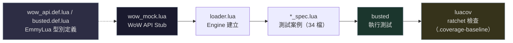

# LunarUI &mdash; Claude Context

## 常用指令

```bash
make check            # lint + format + locale-check + 940 tests（提交前必跑）
make test             # 僅跑 busted spec/
make coverage         # 跑覆蓋率 + ratchet 檢查（對照 .coverage-baseline）
make coverage-update  # 測試覆蓋率上升時更新 baseline
make format-fix       # stylua 自動修格式
```

> ratchet：`make coverage` 若低於 `.coverage-baseline` 會失敗；提升覆蓋率後跑 `make coverage-update` 提交新 baseline。

---

## 專案概要

- **平台**：WoW 12.0.1（Interface: 120001），Lua 5.1（LuaJIT）
- **架構**：Ace3 + oUF + LibActionButton + LibSharedMedia
- **組成**：
  - `LunarUI/` &mdash; 主插件
  - `LunarUI_Options/` &mdash; LoadOnDemand 設定介面
    - `Options.lua` 僅含 header + `ApplySection` dispatcher；實際區段在 `sections/*.lua`
    - 每個 section 透過 TOC varargs `Private.sections.X = function(ctx) ... end` 註冊，`ctx` 注入 `L` / `GetDB` / `RefreshUI` / `LunarUI`
    - 搜尋與 Frame 樣式分別在 `Search.lua` / `Frame.lua`，spec 以共用 `Private` table 驗證 wiring
  - `LunarUI_Debug/` &mdash; LoadOnDemand 診斷工具（`/lunar debugvigor` 時自動載入）
- **進入點**：`Core/Init.lua` 最先執行，建立 `Engine.LunarUI`
- **模組存取**：`local _ADDON_NAME, Engine = ...` → `Engine.LunarUI`
- **Skin 模組**：22 個 Blizzard 介面換膚（`LunarUI/Modules/Skins/`）
- **Sub-module pattern**：`LunarUI/Modules/<Parent>/<Sub>.lua`（如 `Minimap/ButtonCorral.lua`），由 parent module 以 `LunarUI.<SubName>.Init/Scan/Reset` 形式協作

---

## TOC 載入順序


```mermaid
graph LR
    subgraph Locale["語系"]
        L["Locales/enUS.lua<br/>Locales/zhTW.lua"]
    end

    subgraph Boot["啟動"]
        Init["Core/Init.lua"]
        Tokens["Core/Tokens.lua"]
        Defaults["Core/Defaults.lua"]
        Config["Core/Config.lua"]
        Utils["Core/Utils.lua"]
    end

    subgraph CoreLate["Core 後段"]
        Presets["Core/Presets.lua"]
        Serial["Core/Serialization.lua"]
        Wizard["Core/InstallWizard.lua"]
        Cmds["Core/Commands.lua"]
    end

    subgraph Media["媒體"]
        CoreMedia["Core/Media.lua"]
        MediaLua["Media/Media.lua"]
    end

    subgraph UI["UI 模組"]
        UF["UnitFrames"]
        NP["Nameplates"]
        AB["ActionBars"]
        HUD["HUD/*"]
        Mods["Modules/*"]
    end

    L --> Init --> Tokens --> Defaults --> Config --> Utils
    Utils --> Presets --> Serial --> Wizard --> Cmds
    Cmds --> CoreMedia --> MediaLua
    MediaLua --> UI

    style Locale fill:#36331b,stroke:#6c7a89,color:#e0e0e0
    style Boot fill:#1a1a2e,stroke:#6c7a89,color:#e0e0e0
    style CoreLate fill:#36331b,stroke:#6c7a89,color:#e0e0e0
    style Media fill:#2d1b36,stroke:#6c7a89,color:#e0e0e0
    style UI fill:#1b362d,stroke:#6c7a89,color:#e0e0e0
```

> TOC 載入順序重要 &mdash; Locales 先載入，所有模組依賴 `Init.lua` 建立的 Engine。
> 圖中省略了 Profiler、Debug、Tags 等輔助檔案。
> LunarUI_Options 和 LunarUI_Debug 為 LoadOnDemand，不在主 TOC 中。

---

## 模組系統 API

```lua
-- 註冊模組（Core/Init.lua）
LunarUI:RegisterModule("ModuleName", {
    onEnable  = function() ... end,
    onDisable = function() ... end,   -- 可選，反向順序執行
    delay     = 0.5,                  -- 可選，延遲初始化（秒）
    lifecycle = "reversible",         -- 可選，生命週期類型（見下方說明）
})
-- lifecycle 類型：
--   "reversible"       — onDisable 完全還原 Blizzard 預設狀態（預設值；ActionBars、Minimap、Bags、Tooltip）
--   "soft_disable"     — 僅隱藏框架，不還原 Blizzard，需 /reload（UnitFrames、Nameplates）
--   "reload_required"  — 深度修改無法撤銷，需 /reload（Chat、Skins）
--
-- Live-toggle 補強（reversible 強化版，非獨立 lifecycle 類型）：
-- 部分 reversible 模組額外匯出 LunarUI.RebuildXXX() 供 Options 子 toggle 即時套用，
-- 契約：Cleanup → `if not _modulesEnabled then return` → Initialize。
-- _modulesEnabled guard 防止使用者 /lunar off 後透過 sub-toggle 繞過全域停用。
-- 目前採用：DataBars、DataTexts；Tooltip 直接走 Init/Cleanup + 永久 HookScript 內 db.enabled guard

-- 判斷當前模組組合是否需要 /reload（Commands.lua 用於決定是否跳確認對話框）
LunarUI.RequiresReloadForDisable()  -- 任一 non-reversible 模組即 true
-- /lunar off 首次遇到 non-reversible 模組會跳 LUNARUI_DISABLE_CONFIRM 對話框；
-- 使用者點「不再顯示」→ 寫入 profile.warnedOnDisable = true，後續直接停用

-- 註冊 HUD 框架 → 自動納入 ApplyHUDScale（Config.lua）
LunarUI:RegisterHUDFrame("FrameName")

-- 註冊可移動框架 → 納入 /lunar move（dot 語法）
LunarUI.RegisterMovableFrame("name", frame, "顯示名稱")

-- 註冊皮膚（dot 語法）
LunarUI.RegisterSkin("name", "loadEvent", function() ... end)
LunarUI.MarkSkinned(frame)  -- 防重複，已處理則回傳 false

-- SkinStandardFrame 工廠（內建 MarkSkinned 防護）
-- 回傳 nil = 框架不存在；回傳 frame = 首次 skin 或已 skin
LunarUI:SkinStandardFrame("FrameName", { tabPrefix = "...", tabCount = N })
-- ApplySkin 層級也有 skinned[name] 防護，skin 函數最多執行一次（+ 失敗重試一次）

-- 統一字體設定 + 自動註冊到 fontRegistry
LunarUI.SetFont(fs, size, flags)

-- 批次更新所有已註冊 FontString 的字體路徑
LunarUI:ApplyFontSettings()

-- 安全 DB 存取（Utils.lua）
LunarUI.GetModuleDB(key)  -- 回傳 LunarUI.db.profile[key] 或 nil

-- Icon 邊框建立工廠（Skins.lua）
LunarUI.CreateIconBorder(parent, options)

-- oUF Tag 安全包裝（Tags.lua）
-- 所有自訂 tag 方法使用 SafeTag 包裝，pcall 保護避免 API 異常導致崩潰
```

---

## 程式碼慣例

- 共用資源集中在 `Core/Media.lua`：backdrop 模板、`DEBUFF_TYPE_COLORS`、`CASTBAR_COLOR`、`BG_DARKEN`、材質
- oUF 命名空間為 `LunarUF`（透過 TOC 的 `X-oUF` 設定）
- LibActionButton：`local LAB = LibStub("LibActionButton-1.0", true)`
- 字體統一使用 `LunarUI.SetFont(fs, size, flags)`，禁止硬編碼 `STANDARD_TEXT_FONT`
- DB 存取統一使用 `LunarUI.GetModuleDB(key)`，避免多層 nil 檢查
- **Defaults schema 變更規範**：刪欄位 / 改欄位名 / 改 nested 結構時，必須同步在 `Core/Config.lua` 的 `OnInitialize` 內加一次性 migration（比對 `self.db.global.version` vs 當前 TOC version，舊版本跑清理）。只改 `Defaults.lua` 不夠——AceDB 只補缺欄位不會刪舊欄位，使用者 SavedVariables 會累積廢資料。單純新增欄位不需要 migration（AceDB 自動用 defaults 填入）
- stdlib upvalue 統一 camelCase 命名：`mathFloor`、`tableInsert`、`stringUtf8sub`（非 snake_case）
- FloatingCombatText 預設 opt-in 關閉（`fctEnabled = false`），`LunarUI.Sanitize(val)` 依型別打斷 CLEU taint 鏈（number → `tonumber(tostring())`、string → `tostring()`、boolean → `val == true`）
- 事件頻率監控：`/lunar profile events on|off`，純計數 + 每秒速率
- Skin 個別標籤 locale key（如 `skinCharacter`）與通用分類 key（`Skins`、`SkinsDesc`）均放 `enUS.lua`/`zhTW.lua`；`Options.lua` 的 `local L` 是代理 metatable，無獨立定義
- WoW 12.0 addon API 使用 `C_AddOns` 命名空間（如 `C_AddOns.LoadAddOn`）
- `---@diagnostic disable:` 預設**不加**——純邏輯檔應維持 diagnostic 開啟。僅當 stub 型別無法修正時才加 narrowed 形式（只列真正誤報的 code）並附行內註解說明原因。範例：[Tags.lua](LunarUI/Core/Tags.lua)（`undefined-field`）、[Serialization.lua](LunarUI/Core/Serialization.lua)（`undefined-field, inject-field`）
- 型別定義檔：`wow_api.def.lua`（WoW API stub）、`spec/busted.def.lua`（busted/luassert stub），皆以 `---@meta` 標記

---

## WoW 12.0 Taint 避免模式

| 情境              | 錯誤做法                                   | 正確做法                                                    |
|:----------------|:---------------------------------------|:--------------------------------------------------------|
| Hook 全域函數       | 直接覆寫 `_G.Fn = ...`                     | `hooksecurefunc(obj, "Method", fn)`                     |
| Hook 框架腳本       | 替換 `SetScript`                         | `frame:HookScript("OnEvent", fn)`                       |
| 操作安全框架方法        | 直接替換 `bar.SetScale`                    | `hooksecurefunc` + 再入防護旗標                               |
| 操作 Blizzard 框架  | 直接操作                                   | `if InCombatLockdown() then return end`                 |
| 讀取光環資料          | 直接存取 name / duration                   | `pcall` 安全讀取                                            |
| 讀取光環 boolean 欄位 | `data.isStealable == true`             | `pcall(function() return data.isStealable == true end)` |
| Tooltip 掃描      | `_G[tooltip:GetName().."TextLeft"..i]` | `tooltip:GetTooltipData()` + `_G` fallback              |
| Tooltip 方法呼叫    | 直接呼叫                                   | `pcall(GameTooltip.SetHyperlink, ...)`                  |

---

## 效能慣例

| 技巧                | 做法                             | 範例                                                                    |
|:------------------|:-------------------------------|:----------------------------------------------------------------------|
| 減少全域查找            | 模組層級 upvalue                   | `local format = string.format`                                        |
| stdlib upvalue 命名 | camelCase 取代 snake_case        | `local mathFloor = math.floor`（非 `math_floor`）                        |
| 降低 GC 壓力          | 平行陣列取代 table-of-tables         | `icons[i]`, `durations[i]`                                            |
| 批次處理              | 髒旗標 + 批次計時器                    | 取代逐事件 closure                                                         |
| 卸載閒置腳本            | 動畫結束即移除 OnUpdate               | `SetScript("OnUpdate", nil)`                                          |
| O(1) 查詢           | 高頻查詢用快取表                       | `spellTextureCache[spellID]` + 上限淘汰                                   |
| 快取設定值             | 動畫期間避免每幀查 DB                   | `cachedFadeDuration`                                                  |
| 自動回收              | FontString weak table registry | `__mode = "k"`                                                        |
| 合併 OnUpdate       | 多職責合併為單一 handler               | 協調器 + 子函數分離（如 ActionBars fade + hover）                                |
| 函數拆分              | 過長函數拆為協調器 + 子函數                | `UpdateFadeAndHover` → `UpdateFadeAnimation` + `UpdateHoverDetection` |

---

## 測試框架


```mermaid
graph LR
    TypeDef["wow_api.def.lua / busted.def.lua<br/>EmmyLua 型別定義"] -.-> Mock
    Mock["wow_mock.lua<br/>WoW API Stub"] --> Loader["loader.lua<br/>Engine 建立"]
    Loader --> Spec["*_spec.lua<br/>測試案例（34 檔）"]
    Spec --> Busted["busted<br/>執行測試"]
    Busted --> Cov["luacov<br/>ratchet 檢查<br/>（.coverage-baseline）"]

    style TypeDef fill:#2d2d44,stroke:#6c7a89,color:#e0e0e0
    style Mock fill:#1a1a2e,stroke:#6c7a89,color:#e0e0e0
    style Busted fill:#1b362d,stroke:#6c7a89,color:#e0e0e0
    style Cov fill:#36331b,stroke:#6c7a89,color:#e0e0e0
```

| 項目          | 說明                                                                                               |
|:------------|:-------------------------------------------------------------------------------------------------|
| **工具**      | busted + luacov，設定檔 `.busted` / `.luacov`                                                        |
| **環境模擬**    | `spec/wow_mock.lua`（WoW API stub）、`spec/loader.lua`（模擬 addon 載入 `(_ADDON_NAME, Engine)` varargs） |
| **匯出慣例**    | `LunarUI.FnName = localFn`，讓 local 純函數可被測試存取                                                     |
| **命名衝突**    | 多模組有同名 local 函數時用前綴區分（如 `BagsGetItemLevel` vs `GetItemLevel`）                                    |
| **Mock 要點** | 模組層級有副作用時（`CreateFrame`、`RegisterModule`），需在 spec 內提供完整 stub                                     |
| **驗證**      | 每次修改後跑 `make check`（等同 `luacheck .` + `stylua --check .` + `locale-check` + `busted spec/`）      |

---

## 語言

- 使用者以**繁體中文**溝通
- 本地化：`enUS.lua`（主要）、`zhTW.lua`
- README 與程式碼註解使用繁體中文
