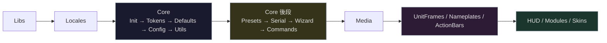

# Contributing to LunarUI

## 📋 前置需求

| 工具           | 用途     | 安裝方式                                                                                         |
|:-------------|:-------|:---------------------------------------------------------------------------------------------|
| **Lua 5.1**  | 執行環境   | `brew install lua@5.1`                                                                       |
| **LuaRocks** | 套件管理   | `brew install luarocks`                                                                      |
| **busted**   | 單元測試   | `luarocks install busted`                                                                    |
| **luacheck** | 靜態分析   | `luarocks install luacheck`                                                                  |
| **luacov**   | 覆蓋率報告  | `luarocks install luacov`                                                                    |
| **StyLua**   | 程式碼格式化 | `cargo install stylua` 或 [GitHub Releases](https://github.com/JohnnyMorganz/StyLua/releases) |

---

## 🚀 Development Setup

```bash
git clone https://github.com/Neal75418/lunar-ui.git
cd lunar-ui
./scripts/update-libs.sh
```

Symlink 到 WoW AddOns 目錄：

```bash
ADDONS="/path/to/World of Warcraft/_retail_/Interface/AddOns"
ln -s "$(pwd)/LunarUI" "$ADDONS/LunarUI"
ln -s "$(pwd)/LunarUI_Options" "$ADDONS/LunarUI_Options"
ln -s "$(pwd)/LunarUI_Debug" "$ADDONS/LunarUI_Debug"
```

---

## 🎨 Code Style

- **語言**：Lua 5.1（LuaJIT），WoW 12.0.1（Interface: 120001）
- **縮排**：4 spaces
- **行寬**：luacheck 無限制；StyLua 格式化至 120 欄（`.stylua.toml`）
- **命名**：
  - 全域函數：`LunarUI.FunctionName` 或 `LunarUI:MethodName`
  - 區域函數：`camelCase`
  - 常數表：`UPPER_SNAKE_CASE`
  - 未使用變數：加 `_` 前綴（如 `_self`、`_event`）
- **註解語言**：繁體中文
- **字體**：統一使用 `LunarUI.SetFont(fs, size, flags)`，禁止硬編碼 `STANDARD_TEXT_FONT`
- **DB 存取**：使用 `LunarUI.GetModuleDB(key)` 取代 `LunarUI.db and LunarUI.db.profile.xxx`
- **匯出慣例**：`LunarUI.FnName = localFn`，讓 local 純函數可被測試存取
- **EmmyLua 診斷**：所有 `.lua` 檔案第一行加 `---@diagnostic disable:` 抑制已知誤報
- **型別定義**：`wow_api.def.lua`、`spec/busted.def.lua` 以 `---@meta` 標記，提供 IDE 補全

---

## 🔨 Development Commands

專案提供 [Makefile](Makefile) 整合所有開發指令：

```bash
make test         # 執行 busted 單元測試
make lint         # 執行 luacheck 靜態分析
make format       # 檢查 stylua 格式
make format-fix   # 自動修正格式
make coverage     # 測試 + 覆蓋率報告（含門檻檢查）
make check        # 一次跑完 lint + format + test
make locale-check # 檢查語系 key 對稱性
```

CI 要求零警告。提交前請確認 `make check` 通過。

---

## 🏗️ Architecture

### TOC 載入順序



> 載入順序重要 — Locales 先於所有模組，所有模組依賴 `Init.lua` 建立的 Engine。

### Module 註冊

所有模組透過 `LunarUI:RegisterModule(name, callbacks)` 註冊：

```lua
LunarUI:RegisterModule("ModuleName", {
    onEnable  = function() ... end,
    onDisable = function() ... end,   -- 可選，反向順序執行
    delay     = 0.5,                  -- 可選，延遲初始化（秒）
})
```

### Taint 規避

WoW 的安全框架有嚴格的 taint 機制。詳細規則參考 [CLAUDE.md](CLAUDE.md) 的 Taint 避免模式表格。

核心原則：

| 情境        | 錯誤做法         | 正確做法                                    |
|:----------|:-------------|:----------------------------------------|
| Hook 全域函數 | 直接覆寫 `_G.Fn` | `hooksecurefunc(obj, "Method", fn)`     |
| 修改框架      | 戰鬥中直接操作      | `if InCombatLockdown() then return end` |
| 存取安全資料    | 直接存取         | `pcall` 包裹                              |

### Skin 模組

新增 Skin 的標準模式：

```lua
local function SkinMyFrame()
    local frame = LunarUI:SkinStandardFrame("MyFrameName", { textDepth = 3 })
    if not frame then return end
    -- ... 自訂邏輯
    return true
end

-- 延遲載入的 Blizzard addon：
LunarUI.RegisterSkin("myframe", "Blizzard_MyAddon", SkinMyFrame)

-- PLAYER_ENTERING_WORLD 時已存在的框架：
LunarUI.RegisterSkin("myframe", "PLAYER_ENTERING_WORLD", SkinMyFrame)
```

---

## 🧪 測試

| 項目          | 說明                                                                                      |
|:------------|:----------------------------------------------------------------------------------------|
| **工具**      | busted + luacov，設定檔 `.busted` / `.luacov`                                               |
| **環境模擬**    | `spec/wow_mock.lua`（WoW API stub）、`spec/loader.lua`（模擬 `(_ADDON_NAME, Engine)` varargs） |
| **匯出慣例**    | `LunarUI.FnName = localFn`，讓 local 純函數可被測試存取                                            |
| **命名衝突**    | 多模組有同名 local 函數時用前綴區分（如 `BagsGetItemLevel` vs `GetItemLevel`）                           |
| **Mock 要點** | 模組層級有副作用時（`CreateFrame`、`RegisterModule`），需在 spec 內提供完整 stub                            |

---

## 📝 Commit Convention

使用 [Conventional Commits](https://www.conventionalcommits.org/)：

```
feat:     新增功能
fix:      修正錯誤
refactor: 重構（不改變行為）
style:    格式調整
perf:     效能改善
docs:     文件更新
test:     測試相關
chore:    維護任務
ci:       CI/CD 變更
```

---

## 🔀 Pull Request


1. Fork 後建立 feature branch
2. 確認 `make check` 通過（lint + format + test）
3. 在遊戲內測試（至少載入 + 基本操作）
4. 提交 PR 並說明變更內容

---

## 📜 License

貢獻的程式碼將以 [GPL-3.0](LICENSE) 授權釋出。
