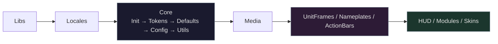

# Contributing to LunarUI

## Development Setup

```bash
git clone https://github.com/Neal75418/lunar-ui.git
cd lunar-ui
./scripts/update-libs.sh
```

Symlink 到 WoW AddOns 目錄：

```bash
ln -s $(pwd)/LunarUI "/path/to/World of Warcraft/_retail_/Interface/AddOns/LunarUI"
ln -s $(pwd)/LunarUI_Options "/path/to/World of Warcraft/_retail_/Interface/AddOns/LunarUI_Options"
```

## Code Style

- **語言**：Lua 5.1（LuaJIT），WoW 12.0.1（Interface: 120001）
- **縮排**：4 spaces
- **行寬**：無限制
- **命名**：
  - 全域函數：`LunarUI.FunctionName` 或 `LunarUI:MethodName`
  - 區域函數：`camelCase`
  - 常數表：`UPPER_SNAKE_CASE`
  - 未使用變數：加 `_` 前綴（如 `_self`, `_event`）
- **註解語言**：繁體中文

## Development Commands

專案提供 [Makefile](Makefile) 整合所有開發指令：

```bash
make test         # 執行 busted 單元測試
make lint         # 執行 luacheck 靜態分析
make format       # 檢查 stylua 格式
make format-fix   # 自動修正格式
make coverage     # 測試 + 覆蓋率報告（含門檻檢查）
make check        # 一次跑完 lint + format + test
make locale-check # 檢查語系 key 對稱性
```

### Linting

專案使用 [luacheck](https://github.com/mpeterv/luacheck) 進行靜態分析。

```bash
# 安裝
luarocks install luacheck

# 執行（自動讀取 .luacheckrc）
luacheck .
# 或
make lint
```

CI 要求零警告。提交前請確認 `make check` 通過。

## Architecture

### TOC 載入順序



### Module 註冊

所有模組透過 `LunarUI:RegisterModule(name, callbacks)` 註冊，`callbacks` 為包含 `onEnable`、`onDisable`（可選）、`delay`（可選）的 table。在 Ace3 `OnEnable` 時初始化。

### Taint 規避

WoW 的安全框架有嚴格的 taint 機制。修改暴雪框架時：

| 情境 | 錯誤做法 | 正確做法 |
|:-----|:---------|:---------|
| Hook 全域函數 | 直接覆寫 `_G.Fn` | `hooksecurefunc(obj, "Method", fn)` |
| 修改框架 | 戰鬥中直接操作 | `if InCombatLockdown() then return end` |
| 存取安全資料 | 直接存取 | `pcall` 包裹 |
| 修改屬性 | `rawset` | 避免使用 |

### Skin 模組

新增 Skin 的模式：

```lua
local function SkinMyFrame()
    local frame = LunarUI:SkinStandardFrame("MyFrameName", { textDepth = 3 })
    if not frame then return end
    -- ... 自訂邏輯
    return true
end

-- 對於延遲載入 addon：
LunarUI.RegisterSkin("myframe", "Blizzard_MyAddon", SkinMyFrame)

-- 對於 PLAYER_ENTERING_WORLD 時已存在的框架：
LunarUI.RegisterSkin("myframe", "PLAYER_ENTERING_WORLD", SkinMyFrame)
```

## Commit Convention

使用 [Conventional Commits](https://www.conventionalcommits.org/)：

```
feat: 新增功能
fix: 修正錯誤
refactor: 重構（不改變行為）
style: 格式調整
perf: 效能改善
docs: 文件更新
chore: 維護任務
ci: CI/CD 變更
```

## Pull Request


1. Fork 後建立 feature branch
2. 確認 `make check` 通過（lint + format + test）
3. 在遊戲內測試（至少載入 + 基本操作）
4. 提交 PR 並說明變更內容

## License

貢獻的程式碼將以 [GPL-3.0](LICENSE) 授權釋出。
