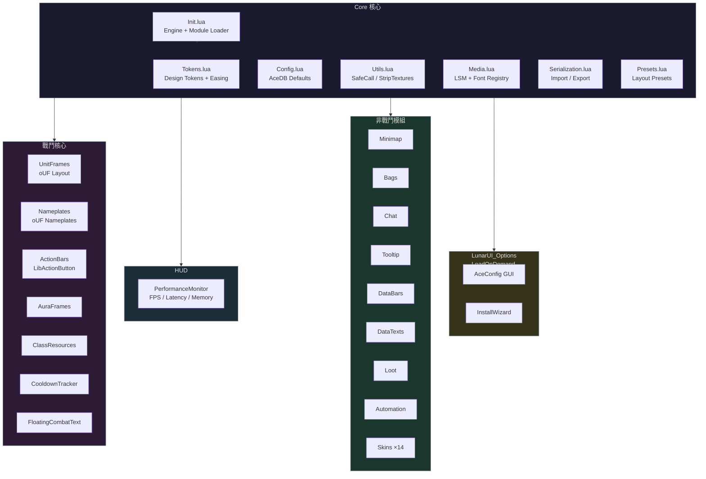
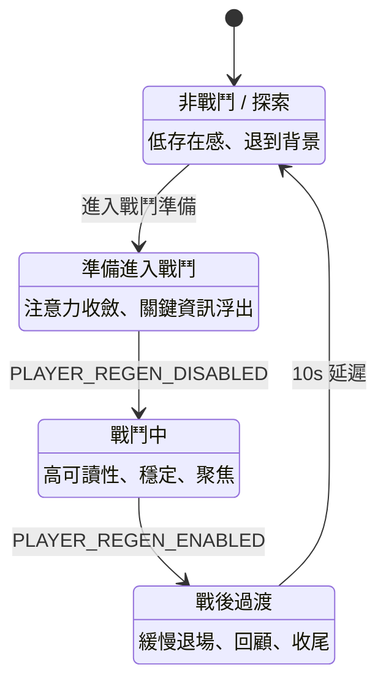
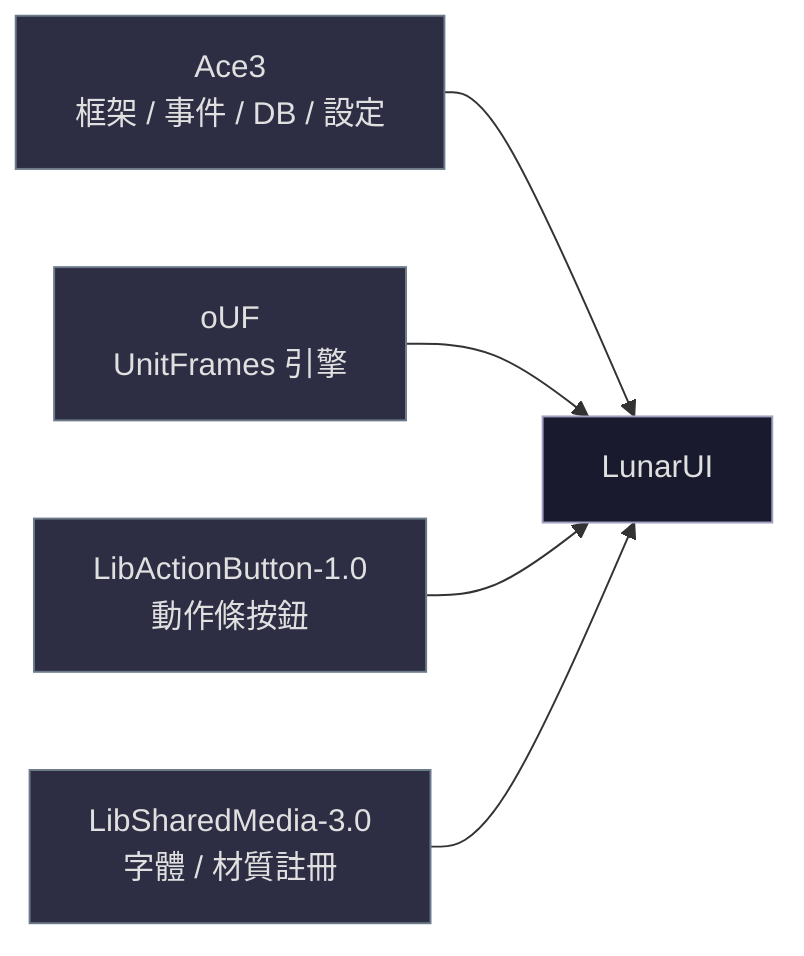
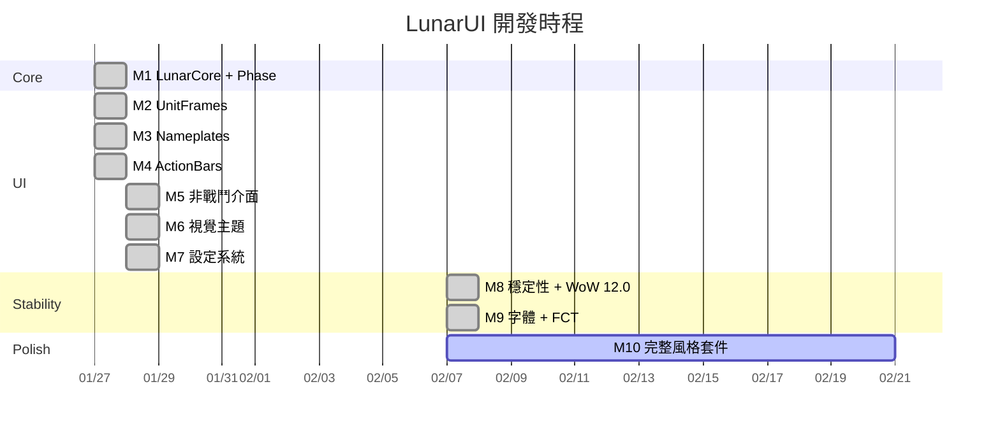

<p align="center">
  
  
  
</p>

# LunarUI

> 低存在感、不干擾、長時間遊玩不累。以 **Phase（月相）** 狀態機驅動所有 UI 行為。

World of Warcraft 12.0 完整 UI 替換插件。

---

## 架構總覽



---

## Phase 狀態機

所有 UI 行為由 Phase 狀態機驅動 — 控制「誰有顯示權」，不是切換畫面。



> Phase 架構已完成，視覺過渡尚未啟用，目前固定運行於 FULL。

---

## 模組一覽

| 類別       | 模組                 | 說明                                                       |
|:---------|:-------------------|:---------------------------------------------------------|
| **戰鬥核心** | UnitFrames         | Player / Target / Focus / Pet / Party / Raid / Boss（oUF） |
|          | Nameplates         | 敵方 / 友方名牌（oUF）                                           |
|          | ActionBars         | 動作條 1-6 + 寵物 + 姿態（LibActionButton）                       |
|          | AuraFrames         | Buff / Debuff 框架（含計時條）                                   |
|          | ClassResources     | 職業資源條（連擊點、聖能等）                                           |
|          | CooldownTracker    | 冷卻追蹤                                                     |
|          | FloatingCombatText | 浮動戰鬥數字（傷害、治療、暴擊）                                         |
| **HUD**  | PerformanceMonitor | FPS / 延遲 / 記憶體                                           |
| **非戰鬥**  | Minimap            | 座標、區域文字、按鈕整理                                             |
|          | Bags               | 整合背包、裝等顯示、搜尋、自動賣灰                                        |
|          | Chat               | 頻道色、職業色、滑鼠滾輪、懸浮背景                                        |
|          | Tooltip            | 裝等、職業色邊框、目標的目標、ID 顯示                                     |
|          | DataBars           | 經驗 / 榮譽 / 休息進度條                                          |
|          | DataTexts          | 可自訂的文字資訊覆蓋層                                              |
|          | Loot               | 拾取框架美化                                                   |
|          | Automation         | 自動賣灰、自動郵件                                                |
|          | Skins              | 14 個 Blizzard 介面換膚                                       |
| **設定**   | LunarUI_Options    | AceConfig 設定介面（LoadOnDemand）                             |

---

## 技術棧



---

## 安裝

```bash
git clone https://github.com/Neal75418/lunar-ui.git
cd lunar-ui && ./scripts/update-libs.sh
cp -r LunarUI LunarUI_Options "/path/to/World of Warcraft/_retail_/Interface/AddOns/"
```

---

## 指令

`/lunar` 或 `/lui`

| 指令                    | 說明              |
|:----------------------|:----------------|
| `config`              | 開啟設定面板          |
| `install`             | 重新執行安裝精靈        |
| `status`              | 版本、Phase、Tokens |
| `move`                | 框架拖曳模式          |
| `keybind`             | 按鍵綁定模式          |
| `reset [all]`         | 重置框架位置          |
| `on` / `off`          | 啟用 / 停用         |
| `export` / `import`   | 匯出 / 匯入設定       |
| `debug`               | 除錯模式            |
| `phase [名稱]`          | 查看 / 切換 Phase   |
| `test combat\|phases` | 模擬測試            |

---

## 里程碑



---

## Dependencies

LunarUI 使用以下第三方庫（位於 `LunarUI/Libs/`，不納入版本控制）：

### 核心依賴
- **[oUF](https://github.com/oUF-wow/oUF)** - UnitFrames 和 Nameplates 框架引擎
  - **重要**：請確保使用最新版本以支援 WoW 12.0
  - 官方倉庫：https://github.com/oUF-wow/oUF

### Ace3 系列
- **[Ace3](https://github.com/WoWUIDev/Ace3)** - WoW 插件開發框架
  - **當前版本**：Release-r1390 (2026-02-03)
  - **支援版本**：WoW 12.0.1 (Retail, MoP Classic, Titan Reforged Classic, Classic)
  - 包含模組：
    - 核心：AceAddon-3.0, AceDB-3.0, AceDBOptions-3.0
    - 事件/計時：AceEvent-3.0, AceTimer-3.0, AceBucket-3.0
    - 設定系統：AceConfig-3.0, AceGUI-3.0, AceConsole-3.0
    - 工具：AceHook-3.0, AceLocale-3.0, AceComm-3.0, AceSerializer-3.0, AceTab-3.0
  - 官方倉庫：https://github.com/WoWUIDev/Ace3
  - CurseForge：https://www.curseforge.com/wow/addons/ace3

### 其他
- **[LibSharedMedia-3.0](https://www.curseforge.com/wow/addons/libsharedmedia-3-0)** - 材質/字體管理
  - **當前版本**：v11.2.1 (Revision 164, 2026-01-19) ✅
  - 官方頁面：https://www.curseforge.com/wow/addons/libsharedmedia-3-0
- **[LibActionButton-1.0](https://www.curseforge.com/wow/addons/libactionbutton-1-0)** - ActionBars 按鈕引擎
  - **當前版本**：version 143 (支援 WoW 12.0)
  - 官方頁面：https://www.curseforge.com/wow/addons/libactionbutton-1-0
- CallbackHandler-1.0 (version 8), LibStub (version 2) - 核心工具庫

### 更新方式

#### 更新 oUF
```bash
cd LunarUI/Libs
mv oUF oUF.backup
git clone https://github.com/oUF-wow/oUF.git
rm -rf oUF/.git .gitignore .github
rm -rf oUF.backup
```

#### 更新 Ace3
```bash
cd /tmp
curl -L -o Ace3.zip "https://github.com/WoWUIDev/Ace3/archive/refs/tags/Release-r1390.zip"
unzip -q Ace3.zip
cd /path/to/LunarUI/Libs

# 備份舊版本
mkdir -p ~/Desktop/Ace3_backup_$(date +%Y%m%d)
cp -r Ace* CallbackHandler-1.0 LibStub ~/Desktop/Ace3_backup_$(date +%Y%m%d)/

# 刪除舊版本
rm -rf Ace* CallbackHandler-1.0 LibStub

# 複製新版本
cp -r /tmp/Ace3-Release-r1390/Ace* \
      /tmp/Ace3-Release-r1390/CallbackHandler-1.0 \
      /tmp/Ace3-Release-r1390/LibStub \
      ./

# 更新 LunarUI.toc 中的路徑（如果需要）
# Line 16: Libs\AceDBOptions-3.0.lua → Libs\AceDBOptions-3.0\AceDBOptions-3.0.lua

# 清理
rm -rf /tmp/Ace3*
```

#### 更新 LibSharedMedia-3.0（手動）
由於 CurseForge 有下載保護，需要手動更新：

1. **下載最新版本**：
   - 訪問：https://www.curseforge.com/wow/addons/libsharedmedia-3-0/files
   - 點擊 "v11.2.1" 或最新版本
   - 點擊 "Download" 按鈕下載 ZIP 文件

2. **安裝**：
   ```bash
   cd /path/to/LunarUI/Libs

   # 備份舊版本
   cp -r LibSharedMedia-3.0 ~/Desktop/LibSharedMedia-3.0.backup

   # 刪除舊版本
   rm -rf LibSharedMedia-3.0

   # 解壓新版本（假設下載到 ~/Downloads）
   unzip ~/Downloads/LibSharedMedia-3.0-*.zip -d .

   # 驗證版本號（應該顯示 Revision: 165 或更高）
   head -5 LibSharedMedia-3.0/LibSharedMedia-3.0.lua
   ```

---

## License

[GPL-3.0](LICENSE)

## Author

NealChen
