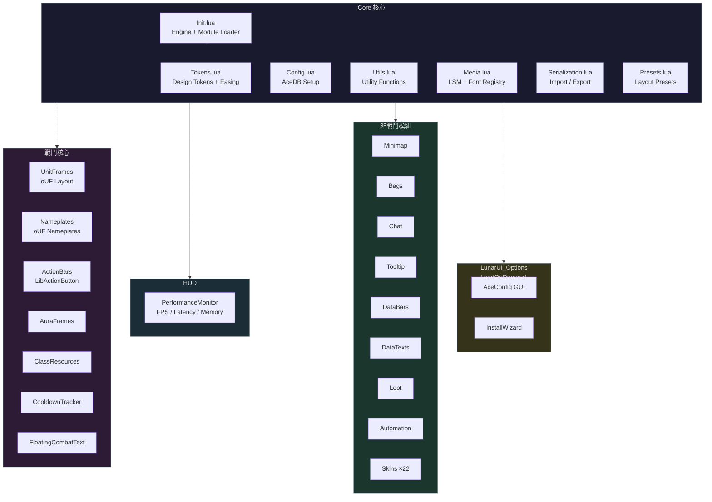
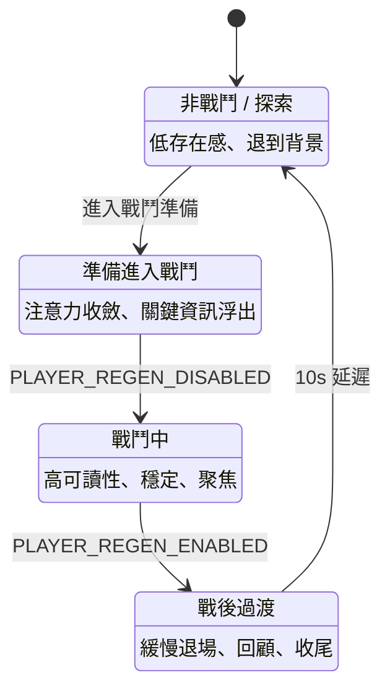
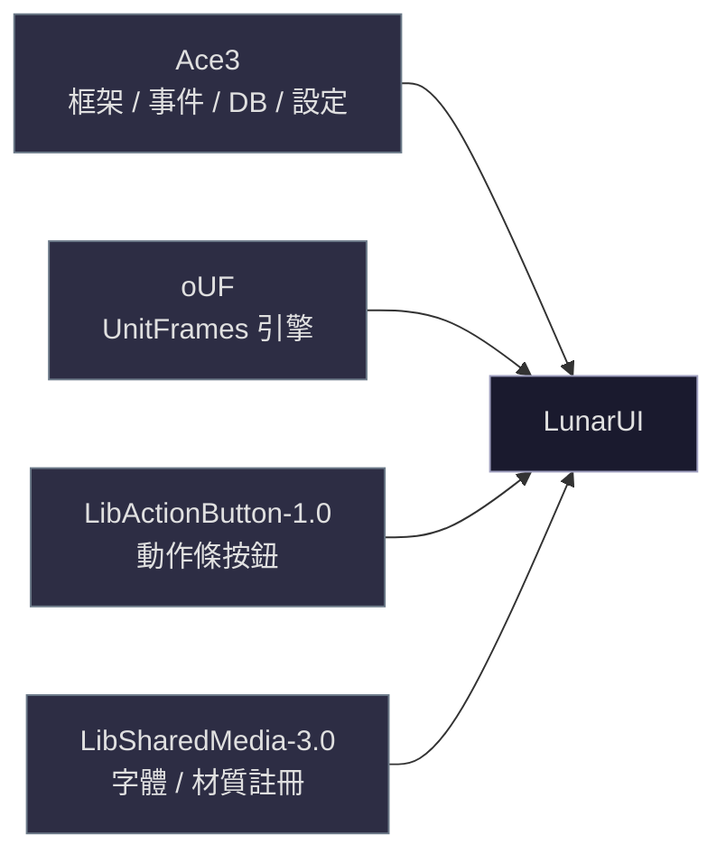
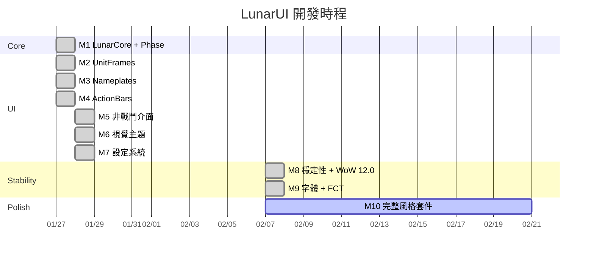
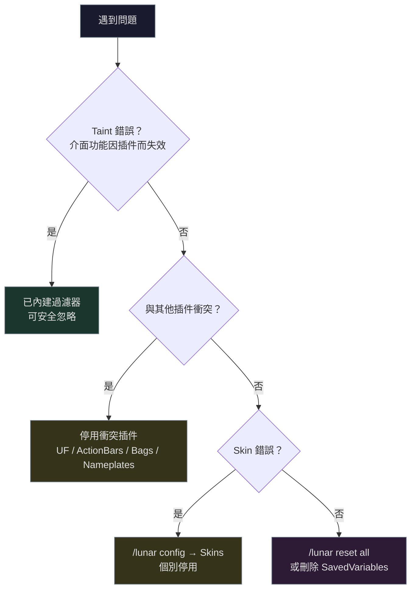

<p align="center">
  
  
  
</p>

# LunarUI

> 低存在感、不干擾、長時間遊玩不累。以 **Phase（月相）** 狀態機驅動所有 UI 行為。

World of Warcraft 12.0 完整 UI 替換插件。

---

## 架構總覽


```mermaid
graph TB
    subgraph Core["Core 核心"]
        Init["Init.lua<br/>Engine + Module Loader"]
        Tokens["Tokens.lua<br/>Design Tokens + Easing"]
        Config["Config.lua<br/>AceDB Setup"]
        Utils["Utils.lua<br/>Utility Functions"]
        Media["Media.lua<br/>LSM + Font Registry"]
        Serial["Serialization.lua<br/>Import / Export"]
        Presets["Presets.lua<br/>Layout Presets"]
    end

    subgraph Combat["戰鬥核心"]
        UF["UnitFrames<br/>oUF Layout"]
        NP["Nameplates<br/>oUF Nameplates"]
        AB["ActionBars<br/>LibActionButton"]
        Aura["AuraFrames"]
        CR["ClassResources"]
        CD["CooldownTracker"]
        FCT["FloatingCombatText"]
    end

    subgraph HUD
        Perf["PerformanceMonitor<br/>FPS / Latency / Memory"]
    end

    subgraph Modules["非戰鬥模組"]
        MM["Minimap"]
        Bags["Bags"]
        Chat["Chat"]
        TT["Tooltip"]
        DB["DataBars"]
        DT["DataTexts"]
        Loot["Loot"]
        Auto["Automation"]
        Skins["Skins ×22"]
    end

    subgraph Options["LunarUI_Options<br/>LoadOnDemand"]
        Opt["AceConfig GUI"]
        Wiz["InstallWizard"]
    end

    Init --> Core
    Core --> Combat
    Core --> HUD
    Core --> Modules
    Core --> Options

    style Core fill:#1a1a2e,stroke:#6c7a89,color:#e0e0e0
    style Combat fill:#2d1b36,stroke:#6c7a89,color:#e0e0e0
    style HUD fill:#1b2d36,stroke:#6c7a89,color:#e0e0e0
    style Modules fill:#1b362d,stroke:#6c7a89,color:#e0e0e0
    style Options fill:#36331b,stroke:#6c7a89,color:#e0e0e0
```

---

## Phase 狀態機

所有 UI 行為由 Phase 狀態機驅動 — 控制「誰有顯示權」，不是切換畫面。


```mermaid
stateDiagram-v2
    [*] --> NEW
    NEW --> WAXING : 進入戰鬥準備
    WAXING --> FULL : PLAYER_REGEN_DISABLED
    FULL --> WANING : PLAYER_REGEN_ENABLED
    WANING --> NEW : 10s 延遲

    NEW : 非戰鬥 / 探索
    NEW : 低存在感、退到背景

    WAXING : 準備進入戰鬥
    WAXING : 注意力收斂、關鍵資訊浮出

    FULL : 戰鬥中
    FULL : 高可讀性、穩定、聚焦

    WANING : 戰後過渡
    WANING : 緩慢退場、回顧、收尾
```

> Phase 架構已完成，視覺過渡尚未啟用，目前固定運行於 FULL。

---

## 模組一覽

| 類別       | 模組                 | 說明                                                       |
|:---------|:-------------------|:---------------------------------------------------------|
| **戰鬥核心** | UnitFrames         | Player / Target / TargetTarget / Focus / Pet / Party / Raid / Boss（oUF） |
|          | Nameplates         | 敵方 / 友方名牌（oUF）                                           |
|          | ActionBars         | 動作條 1-6 + 寵物 + 姿態（LibActionButton）                       |
|          | AuraFrames         | Buff / Debuff 框架（含計時條）                                   |
|          | ClassResources     | 職業資源條（連擊點、聖能等）                                           |
|          | CooldownTracker    | 冷卻追蹤                                                     |
|          | FloatingCombatText | 浮動戰鬥數字（傷害、治療、暴擊）                                         |
| **HUD**  | PerformanceMonitor | FPS / 延遲 / 記憶體                                           |
| **非戰鬥**  | Minimap            | 座標、區域文字、按鈕整理                                             |
|          | Bags               | 整合背包、裝等顯示、搜尋、自動賣灰                                        |
|          | Chat               | 頻道色、職業色、滑鼠滾輪、懸浮背景                                        |
|          | Tooltip            | 裝等、職業色邊框、目標的目標、ID 顯示                                     |
|          | DataBars           | 經驗 / 聲望 / 榮譽進度條                                          |
|          | DataTexts          | 可自訂的文字資訊覆蓋層                                              |
|          | Loot               | 拾取框架美化                                                   |
|          | Automation         | 自動修裝、戰場自動釋放、成就截圖、自動接受任務                                  |
|          | Skins              | 22 個 Blizzard 介面換膚                                       |
| **設定**   | LunarUI_Options    | AceConfig 設定介面（LoadOnDemand）                             |

---

## 技術棧


```mermaid
graph LR
    Ace3["Ace3<br/>框架 / 事件 / DB / 設定"] --> LunarUI
    oUF["oUF<br/>UnitFrames 引擎"] --> LunarUI
    LAB["LibActionButton-1.0<br/>動作條按鈕"] --> LunarUI
    LSM["LibSharedMedia-3.0<br/>字體 / 材質註冊"] --> LunarUI

    style Ace3 fill:#2d2d44,stroke:#6c7a89,color:#e0e0e0
    style oUF fill:#2d2d44,stroke:#6c7a89,color:#e0e0e0
    style LAB fill:#2d2d44,stroke:#6c7a89,color:#e0e0e0
    style LSM fill:#2d2d44,stroke:#6c7a89,color:#e0e0e0
    style LunarUI fill:#1a1a2e,stroke:#a0a0c0,color:#e0e0e0
```

---

## 安裝

```bash
git clone https://github.com/Neal75418/lunar-ui.git
cd lunar-ui && ./scripts/update-libs.sh
cp -r LunarUI LunarUI_Options "/path/to/World of Warcraft/_retail_/Interface/AddOns/"
```

---

## 指令

`/lunar` 或 `/lui`

| 指令                  | 說明              |
|:---------------------|:----------------|
| `config`             | 開啟設定面板          |
| `install`            | 重新執行安裝精靈        |
| `status`             | 版本、狀態資訊         |
| `move`               | 框架拖曳模式          |
| `keybind`            | 按鍵綁定模式          |
| `reset [all]`        | 重置框架位置          |
| `toggle` / `on` / `off` | 切換 / 啟用 / 停用 |
| `export` / `import`  | 匯出 / 匯入設定       |
| `debug`              | 除錯模式            |
| `profile [events]`   | 效能 / 事件頻率分析     |
| `test`               | 執行測試            |

---

## 里程碑


```mermaid
gantt
    title LunarUI 開發時程
    dateFormat YYYY-MM-DD
    axisFormat %m/%d

    section Core
    M1 LunarCore + Phase     :done, m1, 2026-01-27, 1d

    section UI
    M2 UnitFrames            :done, m2, 2026-01-27, 1d
    M3 Nameplates            :done, m3, 2026-01-27, 1d
    M4 ActionBars            :done, m4, 2026-01-27, 1d
    M5 非戰鬥介面            :done, m5, 2026-01-28, 1d
    M6 視覺主題              :done, m6, 2026-01-28, 1d
    M7 設定系統              :done, m7, 2026-01-28, 1d

    section Stability
    M8 穩定性 + WoW 12.0     :done, m8, 2026-02-07, 1d
    M9 字體 + FCT            :done, m9, 2026-02-07, 1d

    section Polish
    M10 完整風格套件          :active, m10, 2026-02-07, 14d
```

---

## Dependencies

LunarUI 使用以下第三方庫（位於 `LunarUI/Libs/`，不納入版本控制）：

| 庫 | 版本 | 用途 | 來源 |
|:---|:-----|:-----|:-----|
| **[oUF](https://github.com/oUF-wow/oUF)** | Latest | UnitFrames / Nameplates 引擎 | [GitHub](https://github.com/oUF-wow/oUF) |
| **[Ace3](https://github.com/WoWUIDev/Ace3)** | r1390 | 框架 / 事件 / DB / 設定 | [GitHub](https://github.com/WoWUIDev/Ace3) |
| **[LibSharedMedia-3.0](https://www.curseforge.com/wow/addons/libsharedmedia-3-0)** | v11.2.1 | 材質 / 字體管理 | [CurseForge](https://www.curseforge.com/wow/addons/libsharedmedia-3-0) |
| **[LibActionButton-1.0](https://www.curseforge.com/wow/addons/libactionbutton-1-0)** | v143 | ActionBars 按鈕引擎 | [CurseForge](https://www.curseforge.com/wow/addons/libactionbutton-1-0) |
| CallbackHandler-1.0 | v8 | 回呼處理 | Ace3 內含 |
| LibStub | v2 | 庫版本管理 | Ace3 內含 |

<details>
<summary><strong>Ace3 包含模組</strong></summary>

- **核心**：AceAddon-3.0, AceDB-3.0, AceDBOptions-3.0
- **事件/計時**：AceEvent-3.0, AceTimer-3.0
- **設定系統**：AceConfig-3.0, AceGUI-3.0, AceConsole-3.0
- **工具**：AceHook-3.0, AceLocale-3.0

</details>

<details>
<summary><strong>更新方式</strong></summary>

**oUF**：
```bash
cd LunarUI/Libs
mv oUF oUF.backup
git clone https://github.com/oUF-wow/oUF.git
rm -rf oUF/.git .gitignore .github
rm -rf oUF.backup
```

**Ace3**：
```bash
cd /tmp
curl -L -o Ace3.zip "https://github.com/WoWUIDev/Ace3/archive/refs/tags/Release-r1390.zip"
unzip -q Ace3.zip
cd /path/to/LunarUI/Libs
rm -rf Ace* CallbackHandler-1.0 LibStub
cp -r /tmp/Ace3-Release-r1390/Ace* /tmp/Ace3-Release-r1390/CallbackHandler-1.0 /tmp/Ace3-Release-r1390/LibStub ./
rm -rf /tmp/Ace3*
```

**LibSharedMedia-3.0**（手動）：從 [CurseForge](https://www.curseforge.com/wow/addons/libsharedmedia-3-0/files) 下載 ZIP，解壓至 `LunarUI/Libs/`。

</details>

---

## Troubleshooting


```mermaid
flowchart TD
    Start["遇到問題"] --> Taint{"Taint 錯誤？<br/>介面功能因插件而失效"}
    Taint -->|是| Safe["已內建過濾器<br/>可安全忽略"]
    Taint -->|否| Conflict{"與其他插件衝突？"}
    Conflict -->|是| Disable["停用衝突插件<br/>UF / ActionBars / Bags / Nameplates"]
    Conflict -->|否| SkinErr{"Skin 錯誤？"}
    SkinErr -->|是| DisableSkin["/lunar config → Skins<br/>個別停用"]
    SkinErr -->|否| Reset["/lunar reset all<br/>或刪除 SavedVariables"]

    style Start fill:#1a1a2e,stroke:#6c7a89,color:#e0e0e0
    style Safe fill:#1b362d,stroke:#6c7a89,color:#e0e0e0
    style Disable fill:#36331b,stroke:#6c7a89,color:#e0e0e0
    style DisableSkin fill:#36331b,stroke:#6c7a89,color:#e0e0e0
    style Reset fill:#2d1b36,stroke:#6c7a89,color:#e0e0e0
```

| 問題 | 說明 | 解決方式 |
|:-----|:-----|:---------|
| **Taint 錯誤** | 安全框架被修改觸發警告 | 內建過濾器已抑制，可安全忽略 |
| **插件衝突** | 與 ElvUI / Bartender / Dominos / Plater / AdiBags / Bagnon 等重複 | 停用衝突插件的對應模組 |
| **Skin 錯誤** | Blizzard UI 結構變更 | `/lunar config` → Skins 個別停用 |
| **重置設定** | 框架位置 / 完整重置 | `/lunar reset all` 或刪除 `WTF/.../LunarUI.lua` |

---

## License

[GPL-3.0](LICENSE)

## Author

NealChen
