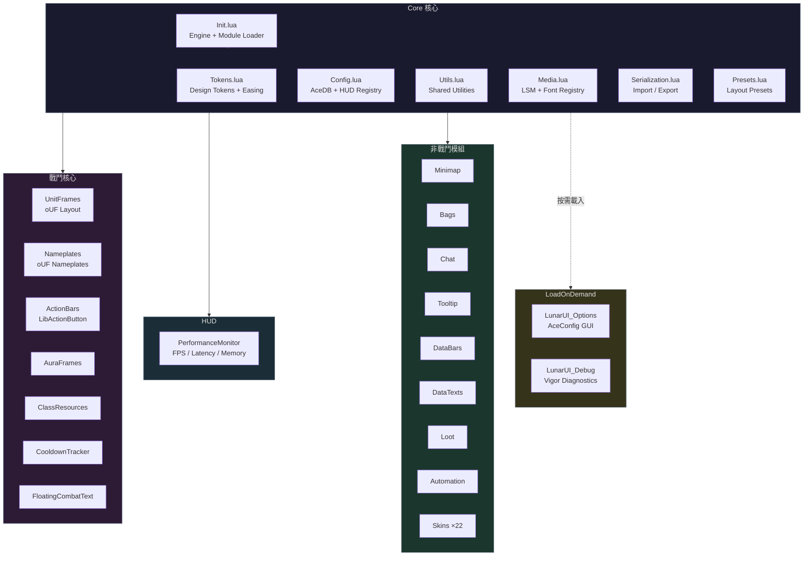
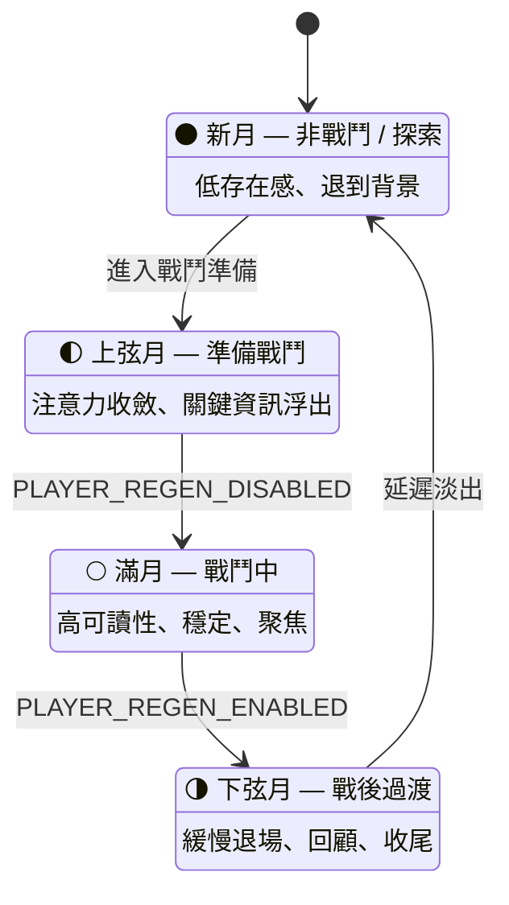
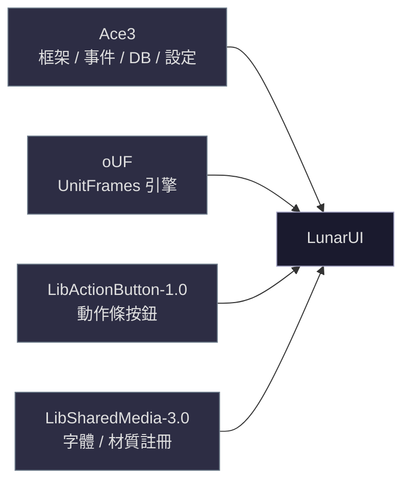
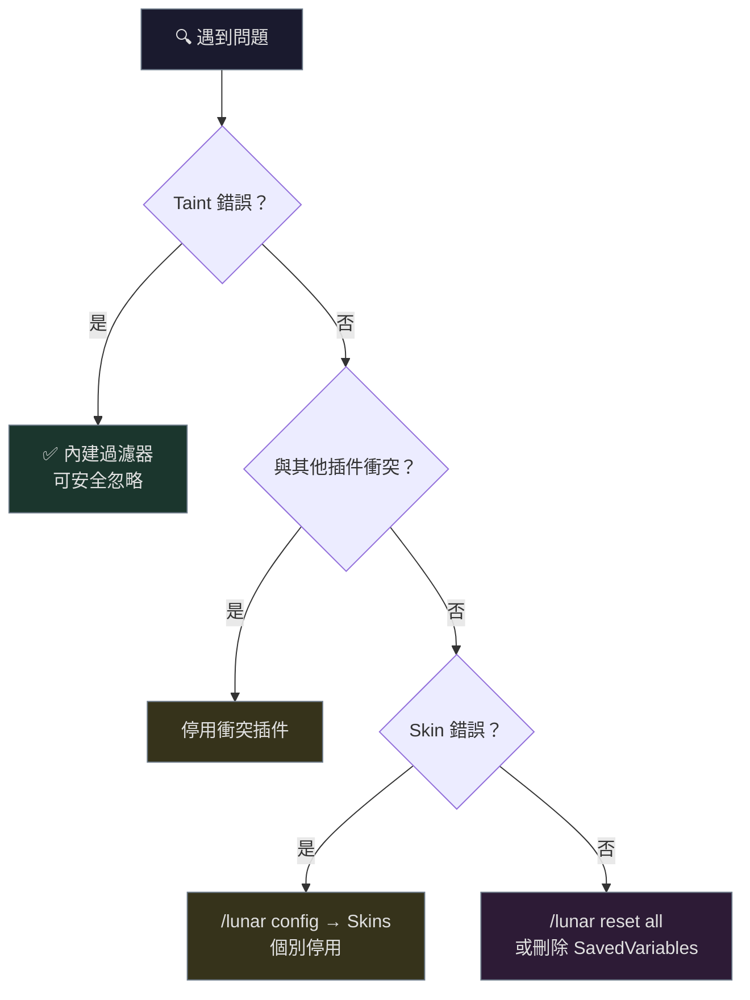
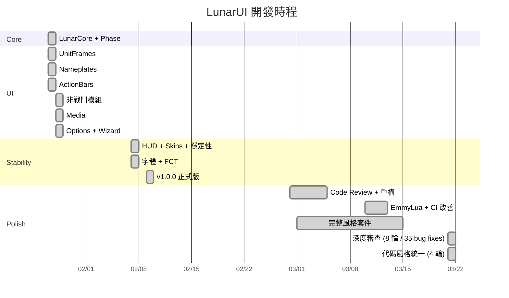

<p align="center">
  
  
  
  
  
  
</p>

<h1 align="center">🌙 LunarUI</h1>

<p align="center">
  <strong>低存在感、不干擾、長時間遊玩不累。</strong><br/>
  以 Phase（月相）狀態機驅動的 World of Warcraft 12.0 完整 UI 替換插件。
</p>

---

## ✨ 特色功能

- 🌙 **Phase 狀態機** — 月相驅動的 UI 行為控制，戰鬥前後自動調整顯示策略
- ⚔️ **完整戰鬥 UI** — UnitFrames / Nameplates / ActionBars 一體化替換，基於 oUF 與 LibActionButton
- 🎯 **HUD 戰鬥資訊** — 職業資源條、冷卻追蹤、光環框架、浮動戰鬥數字
- 🎨 **22 個 Blizzard 換膚** — 角色面板、天賦、成就、拍賣場、專業技能等，統一深色視覺主題
- 📦 **整合背包系統** — 物品分類、裝等顯示、關鍵字搜尋、自動賣灰
- 💬 **聊天增強** — 職業著色、頻道顏色、關鍵字警報、文字複製、懸浮背景
- ⚡ **效能優先** — 框架池回收、材質快取、髒旗標批次處理、平行陣列結構
- 🔧 **完整可配置** — AceConfig GUI 設定介面、設定匯入匯出、DPS / Tank / Healer 佈局預設

---

## 📦 模組一覽

### ⚔️ 戰鬥核心

| 模組                     | 說明                                                                                                 |
|:-----------------------|:---------------------------------------------------------------------------------------------------|
| **UnitFrames**         | Player / Target / TargetTarget / Focus / Pet / Party / Raid / Boss 單位框架（oUF 引擎），含施法條、光環、威脅指示器、距離淡出 |
| **Nameplates**         | 敵方名牌（血量 / 施法條 / Debuff / 威脅色）＋ 友方名牌（簡化顯示），含重疊偵測與偏移堆疊                                               |
| **ActionBars**         | 動作條 1–6 ＋ 寵物條 ＋ 姿態條（LibActionButton-1.0），含淡入淡出、按鍵綁定、冷卻顯示                                           |
| **AuraFrames**         | Buff / Debuff 獨立顯示框架，含計時條、分類過濾、pcall 安全讀取                                                          |
| **ClassResources**     | 職業資源條 — 連擊點、聖能、符文、靈魂碎片等，依專精動態切換                                                                    |
| **CooldownTracker**    | 技能冷卻追蹤面板，自動偵測已學法術並預過濾，含材質快取與上限淘汰                                                                   |
| **FloatingCombatText** | 浮動戰鬥數字 — 傷害 / 治療 / 暴擊放大，框架池回收（20 預建 FontString），Easing 動畫                                          |

### 🎯 HUD

| 模組                     | 說明                         |
|:-----------------------|:---------------------------|
| **PerformanceMonitor** | FPS、網路延遲、記憶體使用量即時顯示，動態更新頻率 |

### 🛠️ 功能模組

| 模組             | 說明                                          |
|:---------------|:--------------------------------------------|
| **Minimap**    | Lunar 風格邊框、座標顯示、區域文字、PvP 著色、時鐘、按鈕整理         |
| **Bags**       | 整合背包視圖、物品等級顯示、綁定標記（BoE/BoU）、關鍵字搜尋、自動賣灰      |
| **Chat**       | 頻道色彩、職業色名字、滑鼠滾輪翻頁、懸浮背景、超連結 Tooltip          |
| **Tooltip**    | 統一邊框與背景、職業 / 陣營色、裝備等級、Spell / Item ID、目標的目標 |
| **DataBars**   | 經驗值 / 聲望 / 榮譽進度條                            |
| **DataTexts**  | 可自訂的文字資訊覆蓋層                                 |
| **Loot**       | 拾取框架美化                                      |
| **Automation** | 自動修裝、戰場自動釋放、成就截圖、自動接受任務                     |
| **FrameMover** | `/lunar move` 框架拖曳定位系統                      |

### 🎨 Skins（22 個 Blizzard 換膚）

<details>
<summary>展開完整列表</summary>

| #  | 模組               | 目標介面             |
|:--:|:-----------------|:-----------------|
| 1  | Character        | 角色面板             |
| 2  | Spellbook        | 法術書              |
| 3  | Talents          | 天賦介面             |
| 4  | Quest            | 任務日誌             |
| 5  | Merchant         | 商人介面             |
| 6  | Gossip           | NPC 對話           |
| 7  | WorldMap         | 世界地圖             |
| 8  | Achievements     | 成就面板             |
| 9  | Mail             | 郵件系統             |
| 10 | Collections      | 收藏（坐騎 / 寵物 / 幻化） |
| 11 | LFG              | 尋找隊伍             |
| 12 | EncounterJournal | 地城 / 團隊手冊        |
| 13 | AuctionHouse     | 拍賣場              |
| 14 | Communities      | 社群 / 公會          |
| 15 | Housing          | 居所系統             |
| 16 | Professions      | 專業技能             |
| 17 | PVP              | PvP 介面           |
| 18 | Settings         | 系統設定             |
| 19 | Trade            | 交易介面             |
| 20 | Calendar         | 行事曆              |
| 21 | WeeklyRewards    | 每週寶庫             |
| 22 | AddonList        | 插件列表             |

</details>

### ⚙️ 附加插件

| 插件                  | 類型           | 說明                                             |
|:--------------------|:-------------|:-----------------------------------------------|
| **LunarUI_Options** | LoadOnDemand | AceConfig 設定介面 ＋ 安裝精靈（`/lunar config` 時自動載入）   |
| **LunarUI_Debug**   | LoadOnDemand | Vigor 診斷工具 ＋ 深度遞迴掃描（`/lunar debugvigor` 時自動載入） |

---

## 🏗️ 架構


```mermaid
graph TB
    subgraph Core["Core 核心"]
        Init["Init.lua<br/>Engine + Module Loader"]
        Tokens["Tokens.lua<br/>Design Tokens + Easing"]
        Config["Config.lua<br/>AceDB + HUD Registry"]
        Utils["Utils.lua<br/>Shared Utilities"]
        Media["Media.lua<br/>LSM + Font Registry"]
        Serial["Serialization.lua<br/>Import / Export"]
        Presets["Presets.lua<br/>Layout Presets"]
    end

    subgraph Combat["戰鬥核心"]
        UF["UnitFrames<br/>oUF Layout"]
        NP["Nameplates<br/>oUF Nameplates"]
        AB["ActionBars<br/>LibActionButton"]
        Aura["AuraFrames"]
        CR["ClassResources"]
        CD["CooldownTracker"]
        FCT["FloatingCombatText"]
    end

    subgraph HUD
        Perf["PerformanceMonitor<br/>FPS / Latency / Memory"]
    end

    subgraph Modules["非戰鬥模組"]
        MM["Minimap"]
        Bags["Bags"]
        Chat["Chat"]
        TT["Tooltip"]
        DB["DataBars"]
        DT["DataTexts"]
        Loot["Loot"]
        Auto["Automation"]
        Skins["Skins ×22"]
    end

    subgraph Addons["LoadOnDemand"]
        Opt["LunarUI_Options<br/>AceConfig GUI"]
        Debug["LunarUI_Debug<br/>Vigor Diagnostics"]
    end

    Init --> Core
    Core --> Combat
    Core --> HUD
    Core --> Modules
    Core -.->|按需載入| Addons

    style Core fill:#1a1a2e,stroke:#6c7a89,color:#e0e0e0
    style Combat fill:#2d1b36,stroke:#6c7a89,color:#e0e0e0
    style HUD fill:#1b2d36,stroke:#6c7a89,color:#e0e0e0
    style Modules fill:#1b362d,stroke:#6c7a89,color:#e0e0e0
    style Addons fill:#36331b,stroke:#6c7a89,color:#e0e0e0
```

### 🌙 Phase 狀態機

所有 UI 行為由 Phase 狀態機驅動 — 控制「誰有顯示權」，而非切換畫面。


```mermaid
stateDiagram-v2
    [*] --> NEW
    NEW --> WAXING : 進入戰鬥準備
    WAXING --> FULL : PLAYER_REGEN_DISABLED
    FULL --> WANING : PLAYER_REGEN_ENABLED
    WANING --> NEW : 延遲淡出

    NEW : 🌑 新月 — 非戰鬥 / 探索
    NEW : 低存在感、退到背景

    WAXING : 🌓 上弦月 — 準備戰鬥
    WAXING : 注意力收斂、關鍵資訊浮出

    FULL : 🌕 滿月 — 戰鬥中
    FULL : 高可讀性、穩定、聚焦

    WANING : 🌗 下弦月 — 戰後過渡
    WANING : 緩慢退場、回顧、收尾
```

> Phase 架構已完成，視覺過渡效果計劃中。

---

## 📥 安裝

### 手動安裝（Git）

```bash
git clone https://github.com/Neal75418/lunar-ui.git
cd lunar-ui && ./scripts/update-libs.sh
```

將以下資料夾複製（或 symlink）到 WoW AddOns 目錄：

```
World of Warcraft/_retail_/Interface/AddOns/
├── LunarUI/              ← 主插件（必須）
├── LunarUI_Options/      ← 設定介面（LoadOnDemand）
└── LunarUI_Debug/        ← 除錯工具（LoadOnDemand，可選）
```

```bash
ADDONS="/path/to/World of Warcraft/_retail_/Interface/AddOns"
cp -r LunarUI LunarUI_Options LunarUI_Debug "$ADDONS/"
```

<details>
<summary><strong>使用 Symlink（開發用途）</strong></summary>

```bash
ADDONS="/path/to/World of Warcraft/_retail_/Interface/AddOns"
ln -s "$(pwd)/LunarUI" "$ADDONS/LunarUI"
ln -s "$(pwd)/LunarUI_Options" "$ADDONS/LunarUI_Options"
ln -s "$(pwd)/LunarUI_Debug" "$ADDONS/LunarUI_Debug"
```

</details>

---

## ⌨️ 指令

`/lunar` 或 `/lui`

| 指令                                  | 說明                                                |
|:------------------------------------|:--------------------------------------------------|
| `/lunar config`                     | 開啟設定面板（自動載入 LunarUI_Options）                      |
| `/lunar install`                    | 重新執行安裝精靈（UI Scale → Layout → ActionBar → Summary） |
| `/lunar status`                     | 顯示版本與啟用狀態                                         |
| `/lunar move`                       | 進入框架拖曳模式                                          |
| `/lunar keybind`                    | 進入按鍵綁定模式                                          |
| `/lunar reset [all]`                | 重置框架位置（`all` = 完整重置）                              |
| `/lunar toggle` / `on` / `off`      | 切換 / 啟用 / 停用插件                                    |
| `/lunar export` / `import`          | 匯出 / 匯入設定檔                                        |
| `/lunar debug`                      | 切換除錯模式（顯示除錯面板）                                    |
| `/lunar profile [events] [on\|off]` | 效能分析 / 事件頻率監控                                     |
| `/lunar debugvigor`                 | Vigor 框架診斷（自動載入 LunarUI_Debug）                    |
| `/lunar testvigor`                  | 切換 Vigor 測試模式                                     |

---

## 🔧 技術棧


```mermaid
graph LR
    Ace3["Ace3<br/>框架 / 事件 / DB / 設定"] --> LunarUI
    oUF["oUF<br/>UnitFrames 引擎"] --> LunarUI
    LAB["LibActionButton-1.0<br/>動作條按鈕"] --> LunarUI
    LSM["LibSharedMedia-3.0<br/>字體 / 材質註冊"] --> LunarUI

    style Ace3 fill:#2d2d44,stroke:#6c7a89,color:#e0e0e0
    style oUF fill:#2d2d44,stroke:#6c7a89,color:#e0e0e0
    style LAB fill:#2d2d44,stroke:#6c7a89,color:#e0e0e0
    style LSM fill:#2d2d44,stroke:#6c7a89,color:#e0e0e0
    style LunarUI fill:#1a1a2e,stroke:#a0a0c0,color:#e0e0e0
```

### 依賴庫

所有第三方庫位於 `LunarUI/Libs/`，由 `.pkgmeta` 管理，不納入版本控制。

| 庫                                                                                  | 版本     | 用途                         | 來源                                                                     |
|:-----------------------------------------------------------------------------------|:-------|:---------------------------|:-----------------------------------------------------------------------|
| **[oUF](https://github.com/oUF-wow/oUF)**                                          | 13.1.1 | UnitFrames / Nameplates 引擎 | [GitHub](https://github.com/oUF-wow/oUF)                               |
| **[Ace3](https://github.com/WoWUIDev/Ace3)**                                       | r1390  | 框架 / 事件 / DB / 設定          | [GitHub](https://github.com/WoWUIDev/Ace3)                             |
| **[LibSharedMedia-3.0](https://www.curseforge.com/wow/addons/libsharedmedia-3-0)** | 11.2.1 | 材質 / 字體管理                  | [CurseForge](https://www.curseforge.com/wow/addons/libsharedmedia-3-0) |
| **[LibActionButton-1.0](https://github.com/Nevcairiel/LibActionButton-1.0)**       | 0.57   | ActionBars 按鈕引擎            | [GitHub](https://github.com/Nevcairiel/LibActionButton-1.0)            |
| CallbackHandler-1.0                                                                | —      | 回呼處理                       | Ace3 內含                                                                |
| LibStub                                                                            | —      | 庫版本管理                      | Ace3 內含                                                                |

<details>
<summary><strong>Ace3 包含模組</strong></summary>

- **核心**：AceAddon-3.0、AceDB-3.0、AceDBOptions-3.0
- **事件 / 計時**：AceEvent-3.0、AceTimer-3.0
- **設定系統**：AceConfig-3.0、AceGUI-3.0、AceConsole-3.0
- **工具**：AceHook-3.0、AceLocale-3.0

</details>

<details>
<summary><strong>手動更新庫</strong></summary>

**oUF**：

```bash
cd LunarUI/Libs
mv oUF oUF.backup
git clone https://github.com/oUF-wow/oUF.git
rm -rf oUF/.git oUF/.gitignore oUF/.github
rm -rf oUF.backup
```

**Ace3**：

```bash
cd /tmp
curl -L -o Ace3.zip "https://github.com/WoWUIDev/Ace3/archive/refs/tags/Release-r1390.zip"
unzip -q Ace3.zip
cd /path/to/LunarUI/Libs
rm -rf Ace* CallbackHandler-1.0 LibStub
cp -r /tmp/Ace3-Release-r1390/Ace* /tmp/Ace3-Release-r1390/CallbackHandler-1.0 /tmp/Ace3-Release-r1390/LibStub ./
rm -rf /tmp/Ace3*
```

**LibSharedMedia-3.0**（手動）：從 [CurseForge](https://www.curseforge.com/wow/addons/libsharedmedia-3-0/files) 下載 ZIP，解壓至 `LunarUI/Libs/`。

</details>

---

## 🛡️ 相容性

### 支援環境

| 項目                | 版本                     |
|:------------------|:-----------------------|
| World of Warcraft | 12.0.1（The War Within） |
| Interface         | 120001                 |
| Lua               | 5.1（LuaJIT）            |
| 語言                | English、繁體中文           |

### 衝突插件

LunarUI 是完整 UI 替換方案。以下插件功能重疊，不建議同時使用：

| 類別        | 衝突插件                            |
|:----------|:--------------------------------|
| **UI 套件** | ElvUI、TukUI、SUI                 |
| **動作條**   | Bartender4、Dominos              |
| **名牌**    | Plater、KuiNameplates、TidyPlates |
| **單位框架**  | SUF、PitBull、ZPerl               |
| **背包**    | AdiBags、Bagnon、ArkInventory     |
| **聊天**    | Prat、Chatter                    |

---

## 🧑‍💻 開發

```bash
make test         # 執行 busted 單元測試（994 tests）
make lint         # 執行 luacheck 靜態分析
make format       # 檢查 stylua 格式
make format-fix   # 自動修正格式
make coverage     # 測試 + 覆蓋率報告（含門檻檢查）
make check        # 一次跑完 lint + format + test
make locale-check # 檢查語系 key 對稱性
```

詳細開發指南請參考 [CONTRIBUTING.md](CONTRIBUTING.md)。

---

## 🔍 故障排除


```mermaid
flowchart TD
    Start["🔍 遇到問題"] --> Taint{"Taint 錯誤？"}
    Taint -->|是| Safe["✅ 內建過濾器<br/>可安全忽略"]
    Taint -->|否| Conflict{"與其他插件衝突？"}
    Conflict -->|是| Disable["停用衝突插件"]
    Conflict -->|否| SkinErr{"Skin 錯誤？"}
    SkinErr -->|是| DisableSkin["/lunar config → Skins<br/>個別停用"]
    SkinErr -->|否| Reset["/lunar reset all<br/>或刪除 SavedVariables"]

    style Start fill:#1a1a2e,stroke:#6c7a89,color:#e0e0e0
    style Safe fill:#1b362d,stroke:#6c7a89,color:#e0e0e0
    style Disable fill:#36331b,stroke:#6c7a89,color:#e0e0e0
    style DisableSkin fill:#36331b,stroke:#6c7a89,color:#e0e0e0
    style Reset fill:#2d1b36,stroke:#6c7a89,color:#e0e0e0
```

| 問題            | 說明                                 | 解決方式                                         |
|:--------------|:-----------------------------------|:---------------------------------------------|
| **Taint 錯誤**  | WoW 安全框架被修改觸發警告                    | LunarUI 內建 taint 過濾器，可安全忽略                   |
| **插件衝突**      | 與 ElvUI / Bartender / Plater 等功能重疊 | 停用衝突插件的對應模組                                  |
| **Skin 載入錯誤** | Blizzard UI 結構因 Patch 變更           | `/lunar config` → Skins → 個別停用問題 Skin        |
| **重置設定**      | 框架位置異常或設定損壞                        | `/lunar reset all` 或刪除 `WTF/.../LunarUI.lua` |
| **字體顯示異常**    | 自訂字體未正確載入                          | `/lunar config` → General → 重選字體             |

---

## 📅 開發歷程


```mermaid
gantt
    title LunarUI 開發時程
    dateFormat YYYY-MM-DD
    axisFormat %m/%d

    section Core
    LunarCore + Phase             :done, m1, 2026-01-27, 1d

    section UI
    UnitFrames                    :done, m2, 2026-01-27, 1d
    Nameplates                    :done, m3, 2026-01-27, 1d
    ActionBars                    :done, m4, 2026-01-27, 1d
    非戰鬥模組                     :done, m5, 2026-01-28, 1d
    Media                         :done, m6, 2026-01-28, 1d
    Options + Wizard              :done, m7, 2026-01-28, 1d

    section Stability
    HUD + Skins + 穩定性           :done, m8, 2026-02-07, 1d
    字體 + FCT                     :done, m9, 2026-02-07, 1d
    v1.0.0 正式版                  :done, m10, 2026-02-09, 1d

    section Polish
    Code Review + 重構             :done, m11, 2026-02-28, 5d
    EmmyLua + CI 改善              :done, m12, 2026-03-10, 3d
    完整風格套件                    :done, m13, 2026-03-01, 14d
    深度審查 (8 輪 / 35 bug fixes)  :done, m14, 2026-03-21, 1d
    代碼風格統一 (4 輪)              :done, m15, 2026-03-21, 1d
```

---

## 📜 授權

[GPL-3.0](LICENSE)

## 作者

**NealChen** — [GitHub](https://github.com/Neal75418)
