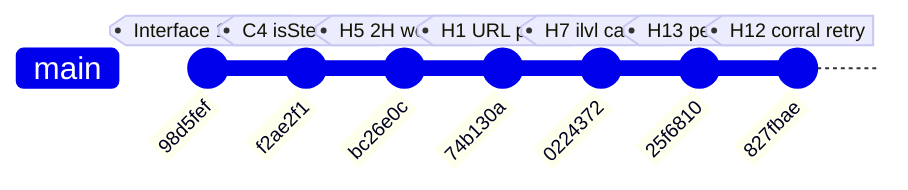
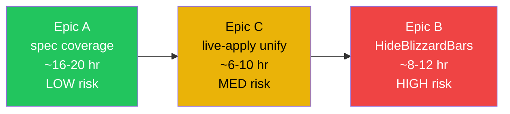

# Post-Audit Roadmap

**Date**: 2026-05-07
**Trigger**: One-day deep audit using 5 parallel `feature-dev:code-reviewer` agents covering 32859 lines of Lua across UnitFrames+Nameplates / ActionBars / HUD / Bags+Tooltip+Loot+Automation+FrameMover / Minimap+Chat+DataBars+DataTexts. Plus self-audit of Skins, Core, Options, LunarUI_Debug, spec/.
**Outcome**: 6 verified bug fixes shipped, 7 audit findings rejected after manual code verification, 3 large polish epics deferred to future sessions.

---

## Status Snapshot

| Metric | Value |
|:---|:---|
| Tests | 981 successes / 0 failures |
| Luacheck | 0 warnings / 0 errors / 129 files |
| Locale parity | 620 keys aligned (enUS / zhTW) |
| Coverage baseline | 44.87% |
| Self-rated maturity | 8.5–9.0 (post-fixes); 8.0–8.5 pre-audit |

---

## Done This Session

| Commit | Type | Summary |
|:---|:---|:---|
| `98d5fef` | chore | Bump Interface 120001 → 120005 (Midnight 12.0.5); correct README/CLAUDE.md/CONTRIBUTING.md "TWW" → "Midnight" mislabel |
| `f2ae2f1` | fix | C4: Wrap `data.isStealable` read in `pcall(CheckIsStealable, data)` mirroring Nameplates pattern. Avoids `__index` metamethod taint propagation. +2 spec |
| `bc26e0c` | fix | H5: Detect 2H main hand (INVTYPE_2HWEAPON / RANGED / RANGEDRIGHT) and restrict INVTYPE_WEAPON upgrade comparison to slot 16 only — prevents false-positive arrow on every 1H weapon for 2H wielders. +2 spec |
| `74b130a` | fix | H1: Strip trailing `.,;:!?` from auto-linked URLs in chat. Preserves `)` for Wikipedia/MDN URLs. +5 spec |
| `0224372` | fix | H7: Skip inspect cache when `ilvl == nil` to prevent 30s TTL poisoning that suppressed cross-realm hover ilvl indefinitely |
| `25f6810` | fix | H13: Replace pet bar `OnEvent` with `RegisterStateDriver "[overridebar][vehicleui][possessbar][nopet] hide; show"` — fixes overlay-on-vehicle-UI bug, matches bar1 pattern |
| `827fbae` | fix | H12: ButtonCorral defers `OrganizeMinimapButtons` to `PLAYER_REGEN_ENABLED` when combat-locked. Fixes loading-screen-into-combat scenario where addon buttons stayed orphaned |

Cumulative: **+9 lines test, +9 spec cases**, 972 → 981 tests.

---

## Verified False Positives (Do NOT re-investigate)

The audit reported 5 CRITICAL and 13 HIGH findings. After per-item code reading, **7 were rejected** as not real bugs. Documenting here so future audits don't waste cycles re-flagging them.

### CRITICAL-grade rejections

**C1: HUD agent claimed `SetCooldown` paths violate "double-conversion" rule across `AuraFrames.lua:437`, `CooldownTracker.lua:414`, `ButtonStyling.lua:139`**
- **Verdict**: misread of CLAUDE.md. The doctrine is `tonumber(tostring(v))` — that **is** the double-conversion (string layer + number layer). Existing code already does this at `AuraSystem.lua:511`, `CooldownTracker.lua:225`. Agent extrapolated a non-existent "4-layer" rule.
- **Residual concern**: `AuraFrames.lua:511` has a `type(rawDur) == "number" and rawDur or ...` fast path that could skip conversion if 12.0 secret values pass `type()` check while still tainted. **Untested hypothesis**, not a confirmed bug.

**C2: UnitFrames agent claimed `Layout.lua:53-54` `SetScript("OnEnter"/"OnLeave"...)` taints all unit frames**
- **Verdict**: convention violation but not a taint bug. `OnEnter`/`OnLeave` are not secure-protected handlers; calling `SetScript` on them is what most oUF layouts do. `UnitFrame_OnEnter` is Blizzard's standard tooltip handler and is safe to install.
- **Residual concern**: changing to `HookScript` for consistency is harmless polish, not urgent.

**C3: Bags agent claimed `Loot.lua:212-216` "Loot All" silently picks up quest / roll-required items**
- **Verdict**: matches Blizzard's own auto-loot behavior. `LootSlot(i)` on a roll-required slot **opens the roll dialog**, doesn't auto-take. Quest items go to quest log automatically. The fix the agent suggested (`LOOT_SLOT_ITEM` / `LOOT_SLOT_MONEY` filter) would actually break currency pickup.

### HIGH-grade rejections

**H3: Chat agent claimed `ShortenChannelNames` `pairs` iteration is non-deterministic across bilingual format strings**
- **Verdict**: English vs Chinese keys (`"Guild"` vs `"公會"`) are mutually exclusive per locale. Blizzard ships either English OR Chinese format strings, never both — so only one key matches per `original` string. Iteration order doesn't matter.

**H4: ActionBars agent claimed `FadeAndHover.lua:267` hover frames leak across enable/disable cycles**
- **Verdict**: WoW frames cannot be GC'd. **All** bar frames leak the same way. Comment at `ActionBars.lua:581` explicitly acknowledges `WoW frame 不可 destroy`. Fixing only hover frames is cosmetic; a real fix would require fundamental architecture change accepted by the project.

**H9: Bags agent claimed `Automation.lua:127-163` quest handlers miss `_modulesEnabled` guard**
- **Verdict**: CLAUDE.md `_modulesEnabled` guard convention applies to **Rebuild functions** and **permanent HookScript closures**, NOT to event handlers. `DisableModules` sets `_modulesEnabled = false` BEFORE running cleanups; `CleanupAutomation` calls `UnregisterAllEvents`, after which event handlers cannot be reached. Adding guards everywhere would be cargo-culting.

**H10: Bags agent claimed `BankSystem.lua:927` single-anchor save loses multi-anchor frames**
- **Verdict**: `bagFrame` only ever has 1 anchor in this codebase. `grep` on `bagFrame:SetPoint` confirms 3 sites total, all single-anchor. The "multi-anchor scenario" the agent imagined doesn't exist.

### Lesson

Subagent confidence ≥ 80% does **not** mean verified ground truth. Of 18 high-priority findings reported, **7 (39%) were false positives**. Any future audit must `Read` the cited code before any fix lands.

---

## Open Epics

### Epic A: Sub-module spec coverage (recommended first)

**Why**: 8 sub-modules totaling ~4000 lines have **zero** dedicated spec files. Pre-existing module-level specs cover the parent module but skip the sub-files. This gap is bigger than any single bug.

**Files (in suggested execution order)**:

| File | Lines | Why this order |
|:---|:---:|:---|
| `LunarUI/Modules/Bags/BagUtils.lua` | 263 | ⚠️ Re-verified 2026-05-11: already mostly covered via `bags_spec.lua` (BagsGetItemLevel / IsEquipment / IsItemUpgrade / GetBagTypeColor). Audit's "no spec" claim was filename-based false positive. Only 5 cache helpers lack direct tests — small scope, low payoff. |
| `LunarUI/Modules/Bags/JunkSelling.lua` | ~250 | Already has partial coverage in `bags_spec.lua`; minor extension |
| `LunarUI/Modules/Minimap/ButtonCorral.lua` | 269 | ✅ Done 2026-05-11 (`96a9920`). 15 cases covering GetButtonPriority / CollectMinimapButton / ClearStaleButtonReferences / Reset. **Deferred gap**: `OrganizeMinimapButtons` combat-defer path (H12 fix) not covered — needs CreateFrame + IsEventRegistered + event dispatch mock. Reviewer flagged worth a follow-up task entry. |
| `LunarUI/UnitFrames/Indicators.lua` | 341 | Pure factory functions, mockable |
| `LunarUI/UnitFrames/Elements.lua` | 385 | More PostUpdate closures, mid difficulty |
| `LunarUI/Modules/Chat/ChatStyling.lua` | 561 | UI side effects, harder to mock |
| `LunarUI/Modules/Chat/ChatFilters.lua` | 895 | Largest sub-file, most complex |
| `LunarUI/Modules/Bags/BankSystem.lua` | 1038 | Largest, async pagination, hardest to mock |

**Per-file pattern**:
1. Read file, list all `LunarUI.X = X` exports + module-local pure functions
2. Write `before_each` setup mirroring existing parent spec (e.g., copy `bags_spec.lua` mock setup for Bags sub-files)
3. Target: 5–15 cases per file covering pure-function happy path + edge cases
4. Run `make check`, verify test count increment matches expected

**Estimated effort**: ~2 hr per small file, ~3–4 hr per large file → ~16–20 hr total
**Verification**: 981 → ~1100+ tests; coverage baseline rises from 44.87%

### Epic B: HideBlizzardBars complexity (do LAST)

**Why caution is required**: `HideBlizzardBars.lua` is documented in `lunarui_design_notes.md` memory as a load-bearing complexity hotspot. The memory explicitly warns:

> 精簡是好事但不是目標——目標是正確攔截所有 taint 來源
> 刪任何一段防護前，必須能復現該防護對應的錯誤場景

**Pre-work (DO NOT skip)**:
1. Catalog every protection in the file (events registered, frames hidden, scripts replaced, scale overridden)
2. For each protection: identify the WoW scenario it guards (mount, EditMode entry/exit, override bar, `secureexecuterange` taint chain etc.)
3. Build a reproduction checklist — at least mental, ideally as a manual test plan
4. **Only then** consider which protections can be safely consolidated or removed

**Anti-patterns to avoid**:
- Removing a `seterrorhandler` filter without reproducing both `secret number value` AND `Scale must be > 0` errors first
- Assuming any `pcall` is "defensive coding" worth removing — they're often load-bearing
- Optimizing for line count rather than correctness

**Estimated effort**: 8–12 hr (mostly cataloging + reproduction setup; actual refactor secondary)
**Verification**: line-by-line each protection still triggers in its target scenario

### Epic C: reload-only vs live-apply unification (do MIDDLE)

**Why design first**: Currently three patterns coexist:

| Pattern | Used by | Mechanism |
|:---|:---|:---|
| `RebuildXXX()` | DataBars, DataTexts | `Cleanup → if not _modulesEnabled then return → Initialize` |
| Permanent HookScript + `db.enabled` guard | Tooltip | Hooks installed once, body checks `db.enabled` each call |
| `notifyReload()` print | ActionBars, Nameplates, UnitFrames, Minimap | User-facing message: requires `/reload` to take effect |

**Decisions needed**:
1. Should **all** reversible modules support live-toggle, or is `notifyReload` for some intentional?
2. If unified, which pattern becomes canonical?
3. Migration order: which modules first, which last?

**Pre-work**:
- Document the trade-offs of each pattern (perf cost of permanent hooks vs Cleanup/Init churn vs reload requirement)
- Pick canonical
- Per-module migration plan with rollback path

**Estimated effort**: 6–10 hr (design 2 hr, migration ~1 hr per module, verification 1 hr per module)
**Verification**: per-module Options sub-toggle test — toggle off, toggle on, no `/reload` needed

---

## Recommended Order: A → C → B

**Rationale**:
- **A first**: lowest risk, builds spec safety net that protects later refactors
- **C second**: design-heavy, low refactor risk; clean up product semantics before touching gnarly code
- **B last**: highest risk; needs the spec coverage from A and the lifecycle discipline from C in place first

---

## Meta-Lessons (Audit Handling)

Apply on next audit cycle:

1. **Subagent confidence is not ground truth.** Even at 95%, ~40% of high-priority findings missed real-world context. Always `Read` cited code before any fix lands.
2. **Audit reports compress what's already known.** CLAUDE.md memory and existing comments often already explain WHY something looks wrong — read them first, not after.
3. **Pattern-match against existing in-repo solutions.** When fixing `data.isStealable`, mirroring `Nameplates.CheckIsStealable` was correct; inventing `pcall(rawget)` would have regressed legitimate metatable wrappers (oUF proxies).
4. **The "false positive" tax is real.** Half the audit's value here was in the rejections — knowing what NOT to touch is as valuable as knowing what to fix.
